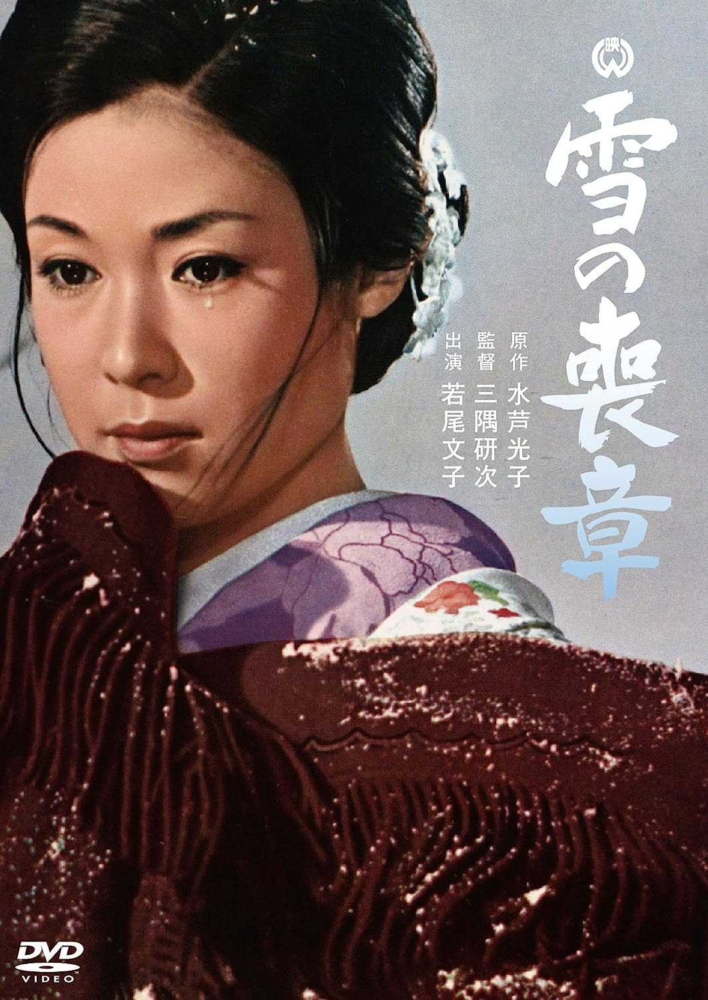

------

------

雪的丧章 / 雪の喪章 (Yuki no Mosho) 是1967年三隅研次监督，水卢光子原作，八住利雄剧本，池野成音乐，若尾文子 / 福田丰土 / 吉川满子 / 中村玉绪 / 天知茂主演的电影。中文字幕由coralsundy自费出资，neola09听译制作。适用于01:32:13的版本。由于电影年代久远，音轨质量一般，听译难免错漏，敬请谅解。

------

**No English Subtitle**

------

**听译/字幕**: noela09 (noela1990@outlook.com) 
**审核/调整**: coralsundy (coralsundy@gmail.com) 
*(由coralsundy自费出资制作, 仅供个人学习)*

------

**中文字幕**: [Yuki.no.Mosho.1967.chs.01-32-13.BYnoela09.rev1.srt](../subtitles/Yuki.no.Mosho.1967.chs.01-32-13.BYnoela09.rev1.srt) 
**English Subtitle**: None

------

**SUBHD**: <https://subhd.tv/a/552453> 
**IMDB**: <https://www.imdb.com/title/tt0257284/> 
**DOUBAN**: <https://movie.douban.com/subject/3011443/>

------

**More Movie Subtitles on My Website**: <a href=''>CLICK HERE</a>

