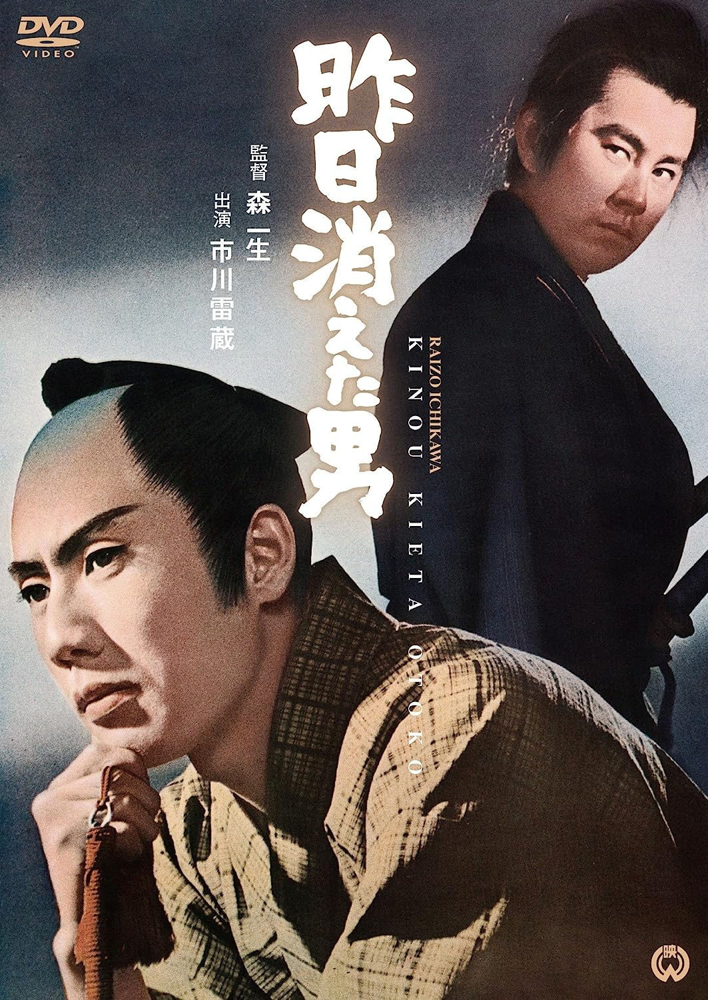

------

------

昨天消失的男人 / 昨日消えた男 (Kino Kieta Otoko / The Man Who Disappeared Yesterday) 是森一生于1963年导演，小国英雄脚本，大森胜太郎音乐，市川雷藏 / 宇津井健 / 高田美和 / 藤村志保主演的电影。英文字幕由coralsundy自费出资，jls001999听译制作完成。有少许错漏和语句不够流畅，可全程完整欣赏电影，适用于01:23:19的版本。由于电影年代久远，音轨质量一般，听译难免错漏，敬请谅解。

------

Kino Kieta Otoko / The Man Who Disappeared Yesterday (1964) is a 1964 movie directed by Kazuo Mori, with notable stars Raizo Ichikawa, Ken Utsui, Miwa Takada, and Shiho Fujimura.

------

**Translation/Subtitle**: jls001999 (jls001999@gmail.com) 
**Review/Proofreading**: coralsundy (coralsundy@gmail.com) 
*(Paid by coralsundy for the translation, personal use only)*

------

**中文字幕**: 尚无 
**English Subtitle**: [Kino.Kieta.Otoko.aka.The.Man.Who.Disappeared.Yesterday.1964.eng.01-23.19.BYjls001999.rev1.srt](../subtitles/Kino.Kieta.Otoko.aka.The.Man.Who.Disappeared.Yesterday.1964.eng.01-23.19.BYjls001999.rev1.srt)

------

**SUBHD**: <https://subhd.tv/a/> 
**IMDB**: <https://www.imdb.com/title/tt1071935/> 
**DOUBAN**: <https://movie.douban.com/subject/26692522/>

------

**More Movie Subtitles on My Website**: <a href=''>CLICK HERE</a>

