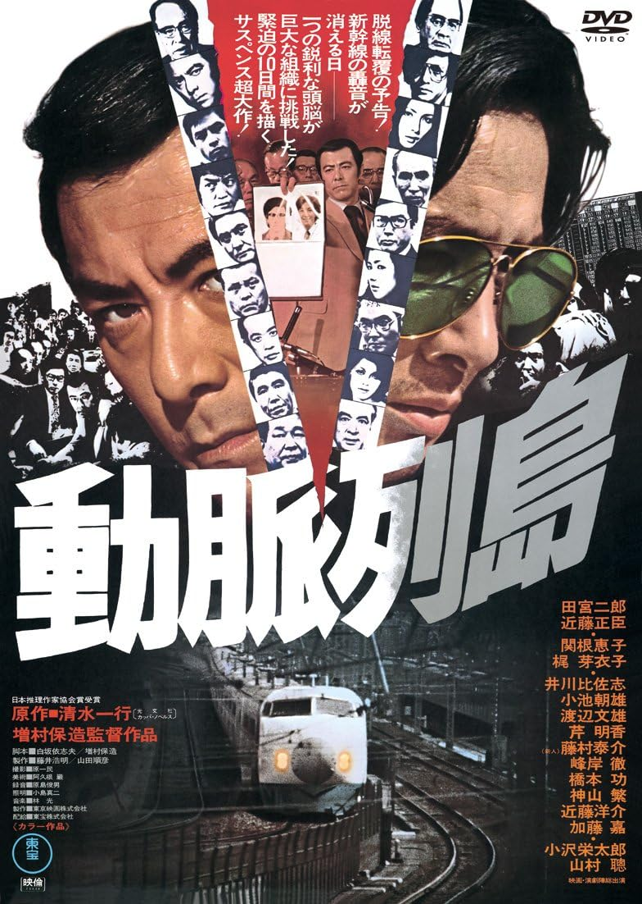

------

------

动脉列岛 / 動脈列島 (Domyaku Retto / Dynamic Islands) 是增村保造于1975年导演，清水一行原作，白坂依志夫 / 增村保造共同脚本，林光音乐，田宫二郎 / 近藤正臣 / 关根惠子(高桥惠子) / 梶芽衣子 / 山村聪 / 小泽荣太郎 / 桥本功主演的电影。此片与《新干线大爆破》同为1975年出品的，新干线列车相关的电影。英文字幕由coralsundy自费出资，jls001999听译制作完成。有少许错漏和语句不够流畅，可全程完整欣赏电影，适用于02:01:00的版本。由于电影年代久远，音轨质量一般，听译难免错漏，敬请谅解。

------

Domyaku Retto / Dynamic Islands (1975) is a 1975 movie directed by Yasuzo Masumura, with notable stars Jiro Tamiya, Masaomi Kondo, Keiko Takahashi(Keiko Sekine), Meiko Kaji, So Yamamura, Eitaro Ozawa, and Isao Hashimoto. This movie, alongside *The Bullet Train*, are twin films in 1975 that both with the premise around **Shinkansen**, which literally translated as the **Bullet Train**.

------

**Translation/Subtitle**: jls001999 (jls001999@gmail.com) 
**Review/Proofreading**: coralsundy (coralsundy@gmail.com) 
*(Paid by coralsundy for the translation, personal use only)*

------

**中文字幕**: 尚无 
**English Subtitle**: [Domyaku.Retto.aka.Dynamic.Islands.1975.eng.02-01-00.BYjls001999.rev1.srt](../subtitles/Domyaku.Retto.aka.Dynamic.Islands.1975.eng.02-01-00.BYjls001999.rev1.srt)

------

**SUBHD**: <https://subhd.tv/a/554424> 
**IMDB**: <https://www.imdb.com/title/tt0228251/> 
**DOUBAN**: <https://movie.douban.com/subject/5951259/>

------

**More Movie Subtitles on My Website**: <a href=''>CLICK HERE</a>

