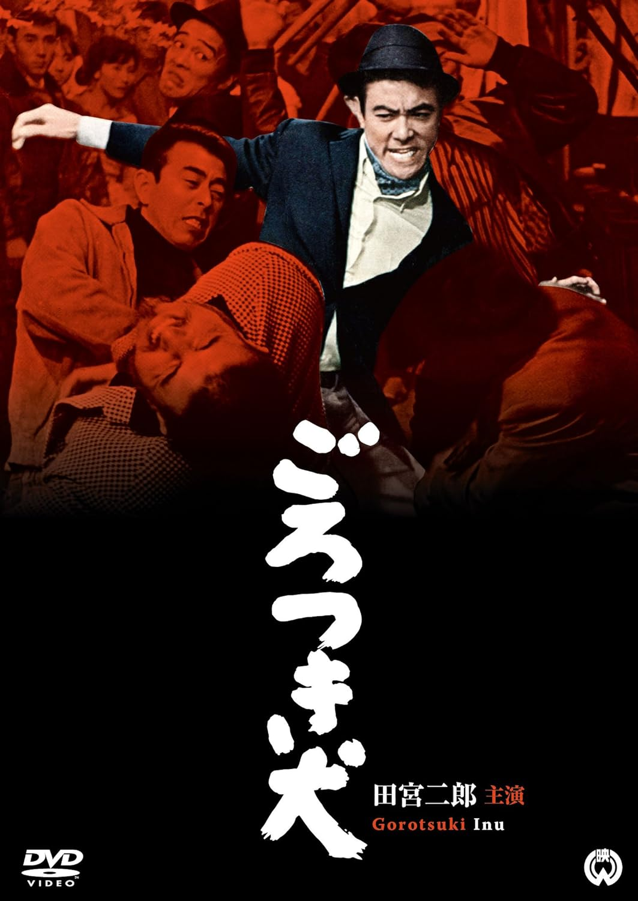

------

------

ごろつき犬 (Gorotsuki Inu / Rogue Dog) 是村野铁太郎于1965年导演，藤本义一脚本，山内正音乐，田宫二郎 / 水谷八重子 / 江波杏子 / 宫口精二 / 天知茂 / 成田三树夫主演的电影。是《犬》系列的第2部作品。英文字幕由coralsundy自费出资，jls001999听译制作完成。有少许错漏和语句不够流畅，可全程完整欣赏电影，适用于01:27:40的版本。由于电影年代久远，音轨质量一般，听译难免错漏，敬请谅解。

------

Gorotsuki Inu / Rogue Dog (1965) is a 1965 movie directed by Tetsutaro Murano, with notable stars Jiro Tamiya. This is the 3rd movie in the Inu / Dog Series.

------

**Translation/Subtitle**: jls001999 (jls001999@gmail.com) 
**Review/Proofreading**: coralsundy (coralsundy@gmail.com) 
*(Paid by coralsundy for the translation, personal use only)*

------

**中文字幕**: 尚无 
**English Subtitle**: [Gorotsuki.Inu.aka.Rogue.Dog.1965.eng.01-27-40.BYjls001999.rev1.srt](../subtitles/Gorotsuki.Inu.aka.Rogue.Dog.1965.eng.01-27-40.BYjls001999.rev1.srt)

------

**SUBHD**: <https://subhd.tv/a/555067> 
**IMDB**: <https://www.imdb.com/title/tt0328041/> 
**DOUBAN**: <https://movie.douban.com/subject/25812527/>

------

**More Movie Subtitles on My Website**: <a href=''>CLICK HERE</a>

