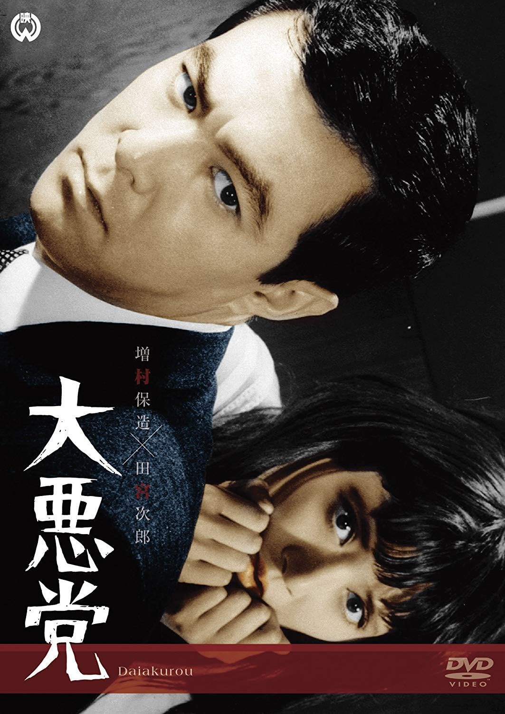

------

------

大恶党 / 大悪党 (Dai Akuto / The Great Villains) 是增村保造于1968年导演，圆山雅也原作，石松爱弘 / 增村保造共同脚本，山内正音乐，田宫二郎 / 绿魔子 / 佐藤庆主演的电影。英文字幕由coralsundy自费出资，jls001999听译制作完成。有少许错漏和语句不够流畅，可全程完整欣赏电影，适用于01:32:51的版本。由于电影年代久远，音轨质量一般，听译难免错漏，敬请谅解。

------

Dai Akuto / The Great Villains (1968) is a 1968 movie directed by Yasuzo Masumura, with notable stars Jiro Tamiya, Mako Midori, and Kei Sato.

------

**Translation/Subtitle**: jls001999 (jls001999@gmail.com) 
**Review/Proofreading**: coralsundy (coralsundy@gmail.com) 
*(Paid by coralsundy for the translation, personal use only)*

------

**中文字幕**: 尚无 
**English Subtitle**: [Dai.Akuto.aka.The.Great.Villains.1968.eng.01-32-51.BYjls001999.rev1.srt](../subtitles/Dai.Akuto.aka.The.Great.Villains.1968.eng.01-32-51.BYjls001999.rev1.srt)

------

**SUBHD**: <https://subhd.tv/a/556348> 
**IMDB**: <https://www.imdb.com/title/tt0228175/> 
**DOUBAN**: <https://movie.douban.com/subject/3169338/>

------

**More Movie Subtitles on My Website**: <a href=''>CLICK HERE</a>

