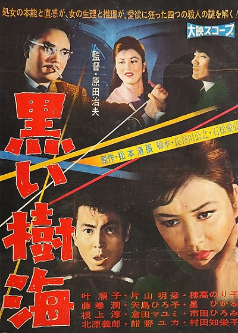

------

------

黑色树海 / 黒い樹海 (Kuroi Jukai / Black Sea of Trees) 是原田治夫于1960年导演，松本清张原作，长谷川公之 / 石松爱弘共同脚本，大森盛太郎音乐，叶顺子 / 藤卷润 / 根上淳主演的电影。英文字幕由coralsundy自费出资，jls001999听译制作完成。有少许错漏和语句不够流畅，可全程完整欣赏电影，适用于01:25:54的版本。由于电影年代久远，音轨质量一般，听译难免错漏，敬请谅解。

------

Kuroi Jukai / Black Sea of Trees (1960) is a 1960 movie directed by Harada Haruo, with notable stars Junko Kano, Jun Fujimaki and Jun Negami.

------

**Translation/Subtitle**: jls001999 (jls001999@gmail.com) 
**Review/Proofreading**: coralsundy (coralsundy@gmail.com) 
*(Paid by coralsundy for the translation, personal use only)*

------

**中文字幕**: 尚无 
**English Subtitle**: [Kuroi.Jukai.aka.Black.Sea.of.Trees.1960.eng.01-25-54.BYjls001999.rev1.srt](../subtitles/Kuroi.Jukai.aka.Black.Sea.of.Trees.1960.eng.01-25-54.BYjls001999.rev1.srt)

------

**SUBHD**: <https://subhd.tv/a/558312> 
**IMDB**: None 
**DOUBAN**: <https://movie.douban.com/subject/26691487/>

------

**More Movie Subtitles on My Website**: <a href=''>CLICK HERE</a>

