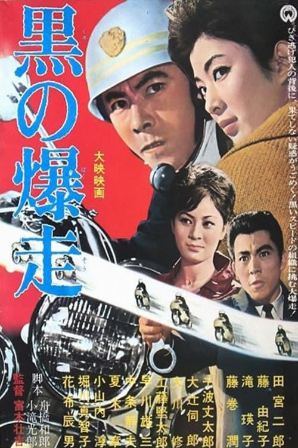

------

------

黑色暴走 / 黒の爆走 (Kuro no Bakuso / Black Speeding) 是富本壮吉于1964年导演，舟桥和郎 / 小滝光郎共同脚本，池野成音乐，田宮二郎 / 藤由纪子主演的电影。大映《黑色系列》的第7作。英文字幕由coralsundy自费出资，jls001999听译制作完成。有少许错漏和语句不够流畅，可全程完整欣赏电影，适用于01:15:33的版本。

------

Kuro no Bakuso / Black Speeding (1964) is the 7th installment of the "Black Series" from Daiei Film. It was directed by Sokichi Tomimoto, with notable stars Jiro Tamiya and Yukiko Fuji.

------

**Translation/Subtitle**: jls001999 (jls001999@gmail.com) 
**Review/Proofreading**: coralsundy (coralsundy@gmail.com) 
*(Paid by coralsundy for the translation, personal use only)*

------

**中文字幕**: 尚无 
**English Subtitle**: [Kuro.no.Bakuso.aka.Black.Speeding.1964.eng.01-15-33.BYjls001999.rev1.srt](../subtitles/Kuro.no.Bakuso.aka.Black.Speeding.1964.eng.01-15-33.BYjls001999.rev1.srt)

------

**SUBHD**: <https://subhd.tv/a/559618> 
**IMDB**: <https://www.imdb.com/title/tt8948516/> 
**DOUBAN**: <https://movie.douban.com/subject/36615166/>

------

**More Movie Subtitles on My Website**: <a href=''>CLICK HERE</a>

