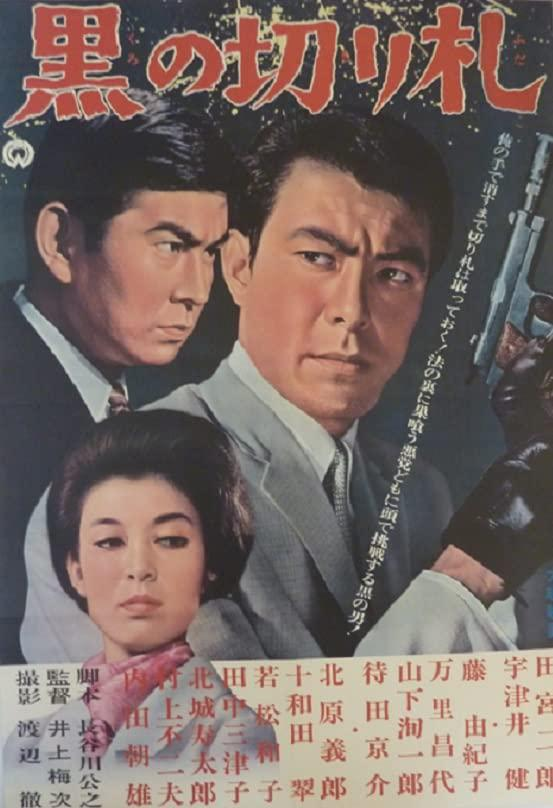

------

------

黑色王牌 / 黒の切り札 (Kuro no Kirifuda / Black Trump Card) 是井上梅次于1964年导演，长谷川公之脚本，秋满义孝音乐，田宮二郎 / 藤由纪子 / 宇津井健 / 万里昌代主演的电影。大映《黑色系列》的第10作。英文字幕由coralsundy自费出资，jls001999听译制作完成。有少许错漏和语句不够流畅，可全程完整欣赏电影，适用于01:28:47的版本。

------

Kuro no Kirifuda / Black Trump Card (1964) is the 10th installment of the "Black Series" from Daiei Film. It was directed by Umetsugu Inoue, with notable stars Jiro Tamiya, Yukiko Fuji, Ken Utsui, and Masayo Banri.

------

**Translation/Subtitle**: jls001999 (jls001999@gmail.com) 
**Review/Proofreading**: coralsundy (coralsundy@gmail.com) 
*(Paid by coralsundy for the translation, personal use only)*

------

**中文字幕**: 尚无 
**English Subtitle**: [Kuro.no.Kirifuda.aka.Black.Trump.Card.1964.eng.01-28-47.BYjls001999.rev1.srt](../subtitles/Kuro.no.Kirifuda.aka.Black.Trump.Card.1964.eng.01-28-47.BYjls001999.rev1.srt)

------

**SUBHD**: <https://subhd.tv/a/559722> 
**IMDB**: <https://www.imdb.com/title/tt8938178/> 
**DOUBAN**: <https://movie.douban.com/subject/34967821/>

------

**More Movie Subtitles on My Website**: <a href=''>CLICK HERE</a>

