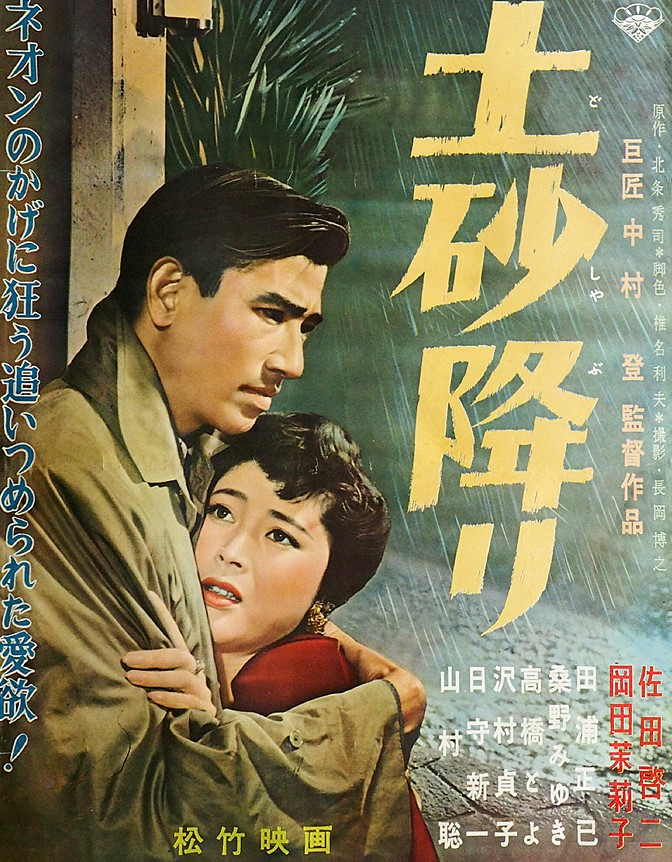

------

------

暴雨 / 土砂降り (Doshaburi / When It Rains, It Pours) 是中村登于1957年导演，北条秀司原作，椎名利夫 / 中村登共同脚本，武满彻音乐，冈田茉莉子 / 佐田启二 / 桑野美雪 / 泽村贞子 / 田浦正巳 / 山村聪主演的电影。英文字幕由coralsundy自费出资，jls001999听译制作完成。有少许错漏和语句不够流畅，可全程完整欣赏电影，适用于01:44:52的版本。由于电影年代久远，音轨质量一般，听译难免错漏，敬请谅解。

------

Doshaburi / When It Rains, It Pours (1957) is a 1957 movie directed by Noboru Nakamura, with notable stars Mariko Okada, Keiji Sada, Miyuki Kuwano, Sadako Sawamura, Masami Taura, and So Yamamura.

------

**Translation/Subtitle**: jls001999 (jls001999@gmail.com) 
**Review/Proofreading**: coralsundy (coralsundy@gmail.com) 
*(Paid by coralsundy for the translation, personal use only)*

------

**中文字幕**: 尚无 
**English Subtitle**: [Doshaburi.aka.When.It.Rains.It.Pours.1957.eng.01-44-52.BYjls001999.rev1.srt](../subtitles/Doshaburi.aka.When.It.Rains.It.Pours.1957.eng.01-44-52.BYjls001999.rev1.srt)

------

**SUBHD**: <https://subhd.tv/a/560736> 
**IMDB**: <https://www.imdb.com/title/tt3523120/> 
**DOUBAN**: <https://movie.douban.com/subject/4824850/>

------

**More Movie Subtitles on My Website**: <a href=''>CLICK HERE</a>

