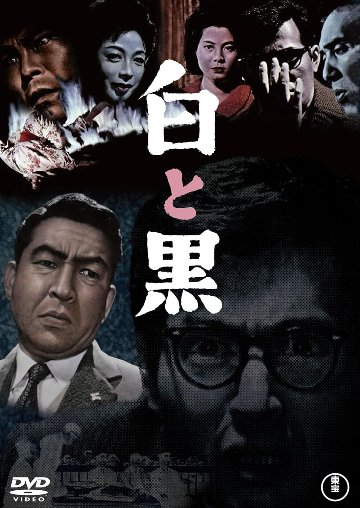

------

------

白与黑 / 白と黒 (Shiro to Kuro / Pressure of Guilt) 是堀川弘通于1963年导演，桥本忍脚本，武满彻音乐，小林桂树 / 仲代达矢 / 井川比佐志 / 东野英治郎 / 乙羽信子 / 西村晃 / 小泽荣太郎主演，松本清张友情客串的电影。英文字幕由coralsundy自费出资，jls001999听译制作完成。有少许错漏和语句不够流畅，可全程完整欣赏电影，适用于01:53:31的版本。由于电影年代久远，音轨质量一般，听译难免错漏，敬请谅解。

------

Shiro to Kuro / Pressure of Guilt (1963) is a 1963 movie directed by Hiromichi Horikawa, with notable stars Keiju Kobayashi, Tatsuya Nakadai, Hisashi Igawa, Eijiro Tono, Nobuko Otowa, Ko Nishimura, and Eitaro Ozawa.

------

**Translation/Subtitle**: jls001999 (jls001999@gmail.com) 
**Review/Proofreading**: coralsundy (coralsundy@gmail.com) 
*(Paid by coralsundy for the translation, personal use only)*

------

**中文字幕**: 尚无 
**English Subtitle**: [Shiro.to.Kuro.aka.Pressure.of.Guilt.1963.eng.01-53-31.BYjls001999.rev1.srt](../subtitles/Shiro.to.Kuro.aka.Pressure.of.Guilt.1963.eng.01-53-31.BYjls001999.rev1.srt)

------

**SUBHD**: <https://subhd.tv/a/561282> 
**IMDB**: <https://www.imdb.com/title/tt0058584/> 
**DOUBAN**: <https://movie.douban.com/subject/3536346/>

------

**More Movie Subtitles on My Website**: <a href=''>CLICK HERE</a>

