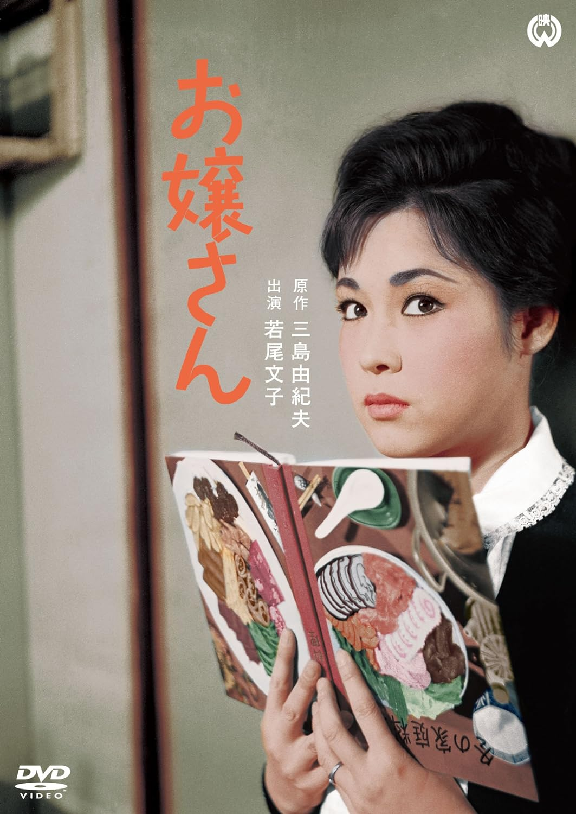

------

------

大小姐 / お嬢さん (Ojosan / Young Miss) 是弓削太郎于1961年导演，三岛由纪夫原作，长谷川公之脚本，池野成音乐，若尾文子 / 川口浩 / 田宫二郎 / 野添瞳主演。英文字幕由coralsundy自费出资，jls001999听译制作完成。有少许错漏和语句不够流畅，可全程完整欣赏电影，适用于01:18:58的版本。由于电影年代久远，音轨质量一般，听译难免错漏，敬请谅解。

------

Ojosan / Young Miss (1961) is a 1961 movie directed by Taro Yuge, with notable stars Ayako Wakao, Hiroshi Kawaguchi, Jiro Tamiya, and Hitomi Nozoe.

------

**Translation/Subtitle**: jls001999 (jls001999@gmail.com) 
**Review/Proofreading**: coralsundy (coralsundy@gmail.com) 
*(Paid by coralsundy for the translation, personal use only)*

------

**中文字幕**: 尚无 
**English Subtitle**: [Ojosan.aka.Young.Miss.1961.eng.01-18-58.BYjls001999.rev1.srt](../subtitles/Ojosan.aka.Young.Miss.1961.eng.01-18-58.BYjls001999.rev1.srt)

------

**SUBHD**: <https://subhd.tv/a/561794> 
**IMDB**: <https://www.imdb.com/title/tt0327069/> 
**DOUBAN**: <https://movie.douban.com/subject/3536273/>

------

**More Movie Subtitles on My Website**: <a href=''>CLICK HERE</a>

