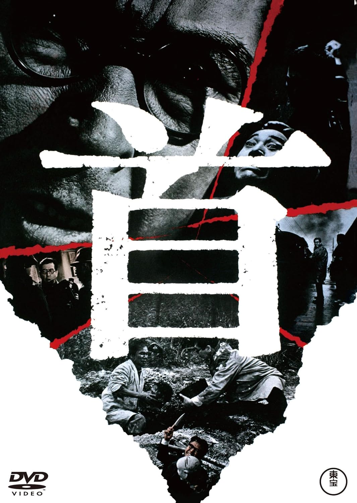

------

------

首 (Kubi) 是森谷司郎于1968年导演，正木ひろし原作，桥本忍脚本，佐藤胜音乐，小林桂树主演的电影。英文字幕由coralsundy自费出资，jls001999听译制作完成。有少许错漏和语句不够流畅，可全程完整欣赏电影，适用于01:39:53的版本。由于电影年代久远，音轨质量一般，听译难免错漏，敬请谅解。

------

Kubi (1968) is a 1968 movie directed by Shiro Moritani, with notable stars Keiju Kobayashi.

------

**Translation/Subtitle**: jls001999 (jls001999@gmail.com) 
**Review/Proofreading**: coralsundy (coralsundy@gmail.com) 
*(Paid by coralsundy for the translation, personal use only)*

------

**中文字幕**: 尚无 
**English Subtitle**: [Kubi.1968.eng.01-39-53.BYjls001999.rev1.srt](../subtitles/Kubi.1968.eng.01-39-53.BYjls001999.rev1.srt)

------

**SUBHD**: <https://subhd.tv/a/562321> 
**IMDB**: <https://www.imdb.com/title/tt0293337/> 
**DOUBAN**: <https://movie.douban.com/subject/4153685/>

------

**More Movie Subtitles on My Website**: <a href=''>CLICK HERE</a>

