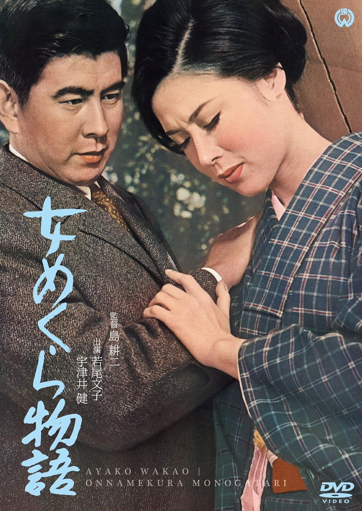

------

------

盲女物语 / 女めくら物語 (Onna Mekura Monogatari / The Story of a Blind Woman) 是岛耕二于1965年导演，舟桥圣一原作，相良准三脚本，大森盛太郎音乐，若尾文子 / 宇津井健主演的电影。英文字幕由coralsundy自费出资，jls001999听译制作完成。有少许错漏和语句不够流畅，可全程完整欣赏电影，适用于01:28:05的版本。由于电影年代久远，音轨质量一般，听译难免错漏，敬请谅解。

------

Kemono no Tawamure / The Frolic of the Beasts (1964) is a 1964 movie directed by Sokichi Tomimoto, with notable stars Ayako Wakao, Seizaburo Kawazu, and Yoshi Kato.

------

**Translation/Subtitle**: jls001999 (jls001999@gmail.com) 
**Review/Proofreading**: coralsundy (coralsundy@gmail.com) 
*(Paid by coralsundy for the translation, personal use only)*

------

**中文字幕**: 尚无 
**English Subtitle**: [Onna.Mekura.Monogatari.aka.The.Story.of.a.Blind.Woman.1965.eng.01-28-05.BYjls001999.rev1.srt](../subtitles/Onna.Mekura.Monogatari.aka.The.Story.of.a.Blind.Woman.1965.eng.01-28-05.BYjls001999.rev1.srt)

------

**SUBHD**: <https://subhd.tv/a/563502> 
**IMDB**: <https://www.imdb.com/title/tt11084544/> 
**DOUBAN**: <https://movie.douban.com/subject/34969213/>

------

**More Movie Subtitles on My Website**: <a href=''>CLICK HERE</a>

