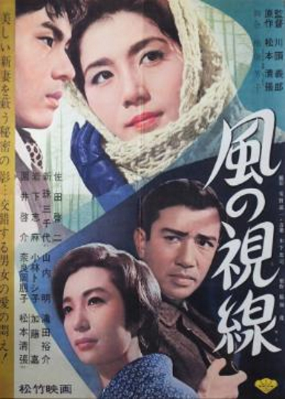

------

------

风的视线 / 風の視線 (Kaze no Shisen / The Hidden Profile) 是川头义郎于1963年导演，松本清张原作，楠田芳子脚本，木下忠司音乐，园井啓介 / 岩下志麻 / 新珠三千代主演的电影，松本清张友情客串。英文字幕由coralsundy自费出资，jls001999听译制作完成。有少许错漏和语句不够流畅，可全程完整欣赏电影，适用于01:45:25的版本。由于电影年代久远，音轨质量一般，听译难免错漏，敬请谅解。

------

Kaze no Shisen / The Hidden Profile (1963) is a 1963 movie directed by Yoshiro Kawazu, with notable stars Keisuke Sonoi, Shima Iwashita, and Michiyo Aratama.

------

**Translation/Subtitle**: jls001999 (jls001999@gmail.com) 
**Review/Proofreading**: coralsundy (coralsundy@gmail.com) 
*(Paid by coralsundy for the translation, personal use only)*

------

**中文字幕**: 尚无 
**English Subtitle**: [Kaze.no.Shisen.aka.The.Hidden.Profile.1963.eng.01-45-25.BYjls001999.rev1.srt](../subtitles/Kaze.no.Shisen.aka.The.Hidden.Profile.1963.eng.01-45-25.BYjls001999.rev1.srt)

------

**SUBHD**: <https://subhd.tv/a/564494> 
**IMDB**: <https://www.imdb.com/title/tt2123987/> 
**DOUBAN**: <https://movie.douban.com/subject/6439449/>

------

**More Movie Subtitles on My Website**: <a href=''>CLICK HERE</a>

