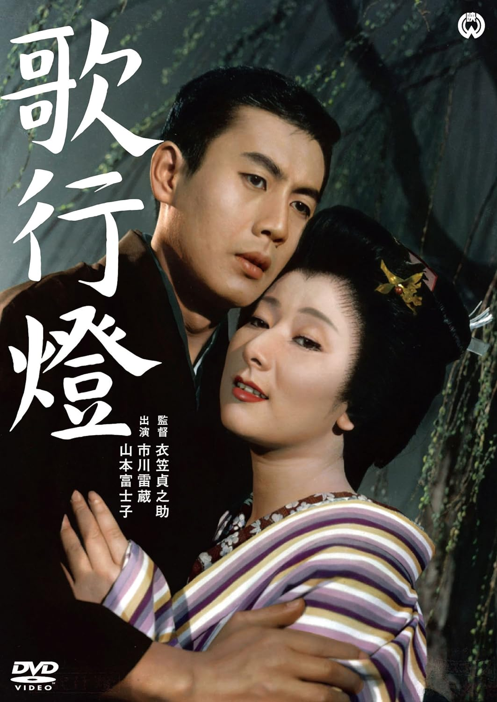

------

------

歌行灯 / 歌行燈 (Uta Andon / The Lantern) 是1960年衣笠贞之助监督，泉镜花原作，衣笠贞之助 / 相良准共同剧本，齐藤一郎音乐，市川雷藏 / 山本富士子主演的电影。中文字幕由coralsundy自费出资，moello听译制作，noela09审核润色。适用于01:53:17的版本。由于电影年代久远，音轨质量一般，听译难免错漏，敬请谅解。

------

**No English Subtitle**

------

**听译/字幕**: moello (moello1909@outlook.com) 
**审核/润色**: noela09 (noela1990@outlook.com) 
**校对/调整**: coralsundy (coralsundy@gmail.com) 
*(由coralsundy自费出资制作, 仅供个人学习)*

------

**中文字幕**: [Uta.Andon.aka.The.Lantern.1960.chs.01-53-17.BYmoello.rev1.srt](../subtitles/Uta.Andon.aka.The.Lantern.1960.chs.01-53-17.BYmoello.rev1.srt) 
**English Subtitle**: None

------

**SUBHD**: <https://subhd.tv/a/564873> 
**IMDB**: <https://www.imdb.com/title/tt0054431/> 
**DOUBAN**: <https://movie.douban.com/subject/3306334/>

------

**More Movie Subtitles on My Website**: <a href=''>CLICK HERE</a>

