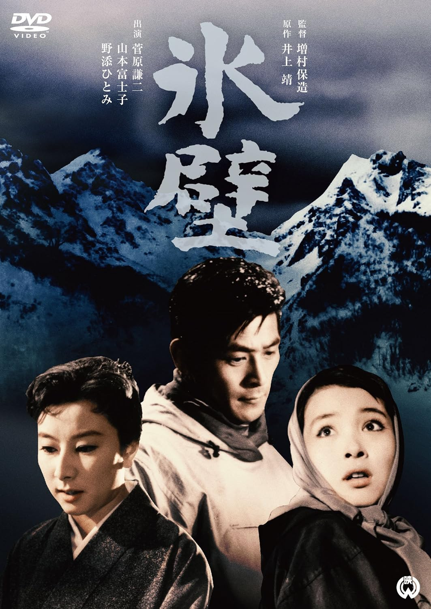

------

------

冰壁 / 氷壁 (Hyoheki / The Precipice) 是增村保造于1958年导演，井上靖原作，新藤兼人脚本，伊福部昭音乐，菅原谦二 / 山本富士子 / 野添瞳 / 川崎敬三主演的电影。英文字幕由coralsundy自费出资，jls001999听译制作完成。有少许错漏和语句不够流畅，可全程完整欣赏电影，适用于01:36:13的版本。由于电影年代久远，音轨质量一般，听译难免错漏，敬请谅解。

------

Hyoheki / The Precipice (1958) ia a 1958 movie directed by Yasuzo Masumura, with notable stars Kenji Sugawara, Fujiko Yamamoto, Hitomi Nozoe, and Keizo Kawasaki.

------

**Translation/Subtitle**: jls001999 (jls001999@gmail.com) 
**Review/Proofreading**: coralsundy (coralsundy@gmail.com) 
*(Paid by coralsundy for the translation, personal use only)*

------

**中文字幕**: 尚无 
**English Subtitle**: [Hyoheki.aka.The.Precipice.1958.eng.01-36-13.BYjls001999.rev1.srt](../subtitles/Hyoheki.aka.The.Precipice.1958.eng.01-36-13.BYjls001999.rev1.srt)

------

**SUBHD**: <https://subhd.tv/a/566209> 
**IMDB**: <https://www.imdb.com/title/tt0051752/> 
**DOUBAN**: <https://movie.douban.com/subject/3169331/>

------

**More Movie Subtitles on My Website**: <a href=''>CLICK HERE</a>

