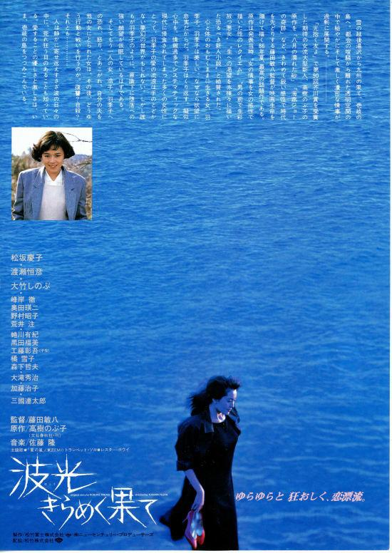

------

------

永远的羽季子 / 波光きらめく果て (Hako Kirameku Hate / Beyond the Shining Sea) 是藤田敏八于1986年导演，高树信子原作，田村孟脚本，佐藤隆音乐，松坂庆子 / 渡濑恒彦 / 大竹忍 / 三国连太郎主演的电影。英文字幕由coralsundy自费出资，jls001999听译制作完成。有少许错漏和语句不够流畅，可全程完整欣赏电影，适用于02:07:46的版本。由于电影年代久远，音轨质量一般，听译难免错漏，敬请谅解。

------

Hako Kirameku Hate / Beyond the Shining Sea (1986) is a 1986 movie directed by Toshiya Fujita, with notable stars Keiko Matsuzaka, Tsunehiko Watase, Shinobu Otake, and Rentaro Mikuni.

------

**Translation/Subtitle**: jls001999 (jls001999@gmail.com) 
**Review/Proofreading**: coralsundy (coralsundy@gmail.com) 
*(Paid by coralsundy for the translation, personal use only)*

------

**中文字幕**: 尚无 
**English Subtitle**: [Hako.Kirameku.Hate.aka.Beyond.the.Shining.Sea.1986.eng.02-07-46.BYjls001999.rev1.srt](../subtitles/Hako.Kirameku.Hate.aka.Beyond.the.Shining.Sea.1986.eng.02-07-46.BYjls001999.rev1.srt)

------

**SUBHD**: <https://subhd.tv/a/567122> 
**IMDB**: <https://www.imdb.com/title/tt0329141/> 
**DOUBAN**: <https://movie.douban.com/subject/1308661/>

------

**More Movie Subtitles on My Website**: <a href=''>CLICK HERE</a>

