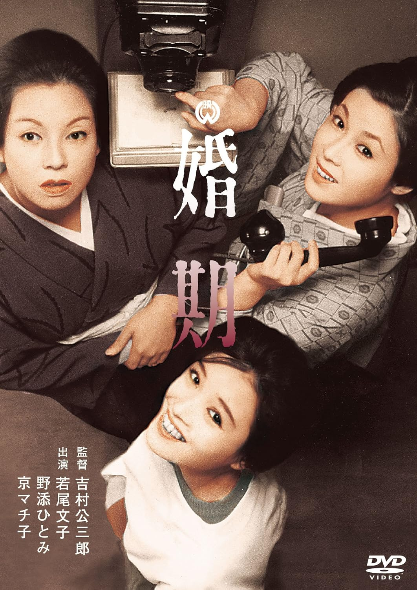

------

------

婚期 (Konki / The Age of Marriage) 是吉村公三郎于1961年导演，水木洋子脚本，池野成音乐， 若尾文子 / 野添瞳 / 京町子 / 船越英二主演的电影。英文字幕由coralsundy自费出资，jls001999听译制作完成。有少许错漏和语句不够流畅，可全程完整欣赏电影，适用于01:37:49的版本。由于电影年代久远，音轨质量一般，听译难免错漏，敬请谅解。

------

Konki / The Age of Marriage (1961) is a 1961 movie directed by Kozaburo Yoshimura, with notable stars Ayako Wakao, Machiko Kyo, Hitomi Nozoe.

------

**Translation/Subtitle**: jls001999 (jls001999@gmail.com) 
**Review/Proofreading**: coralsundy (coralsundy@gmail.com) 
*(Paid by coralsundy for the translation, personal use only)*

------

**中文字幕**: 尚无 
**English Subtitle**: [Konki.aka.The.Age.of.Marriage.1961.eng.01-37-49.BYjls001999.rev1.srt](../subtitles/Konki.aka.The.Age.of.Marriage.1961.eng.01-37-49.BYjls001999.rev1.srt)

------

**SUBHD**: <https://subhd.tv/a/568015> 
**IMDB**: <https://www.imdb.com/title/tt0222129/> 
**DOUBAN**: <https://movie.douban.com/subject/2211822/>

------

**More Movie Subtitles on My Website**: <a href=''>CLICK HERE</a>

