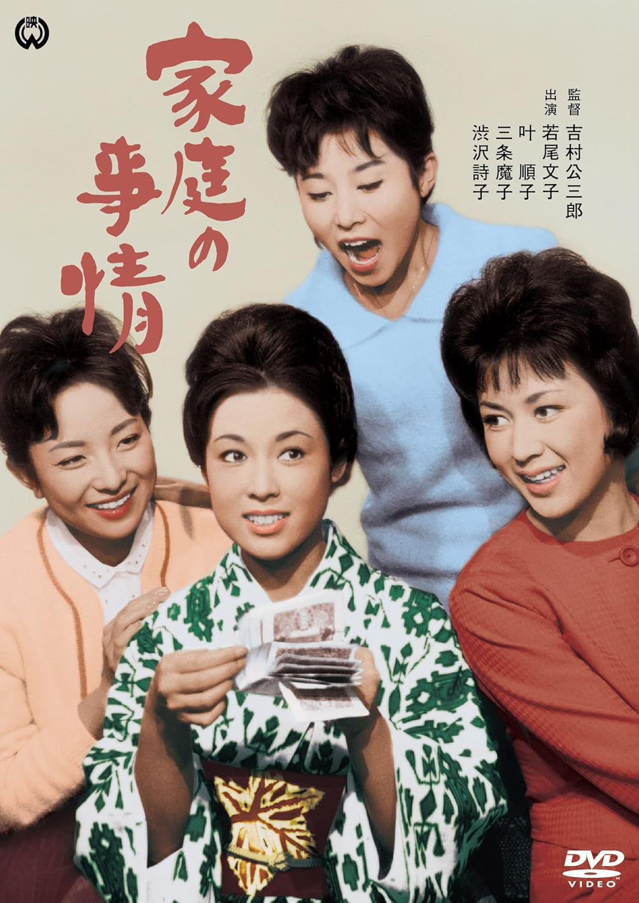

------

------

家庭的事情 / 家庭の事情 (Katei no Jijo / A Family Matter) 是吉村公三郎于1962年导演，新藤兼人脚本，池野成音乐，山村聪 / 若尾文子 / 叶顺子 / 三条魔子 / 船越英二 / 川口浩 / 川崎敬三 / 田宫二郎主演的电影。英文字幕由coralsundy自费出资，jls001999听译制作完成。有少许错漏和语句不够流畅，可全程完整欣赏电影，适用于01:33:08的版本。由于电影年代久远，音轨质量一般，听译难免错漏，敬请谅解。

------

Katei no Jijo / A Family Matter (1962) is a 1962 movie directed by Kozaburo Yoshimura, with notable stars So Yamamura, Ayako Wakao, Junko Kano, Mako Sanjo, Eiji Funakoshi, Hiroshi Kawaguchi, Keizo Kawasaki, and Jiro Tamiya.

------

**Translation/Subtitle**: jls001999 (jls001999@gmail.com) 
**Review/Proofreading**: coralsundy (coralsundy@gmail.com) 
*(Paid by coralsundy for the translation, personal use only)*

------

**中文字幕**: 尚无 
**English Subtitle**: [Katei.no.Jijo.aka.A.Family.Matter.1962.eng.01-33-08.BYjls001999.rev1.srt](../subtitles/Katei.no.Jijo.aka.A.Family.Matter.1962.eng.01-33-08.BYjls001999.rev1.srt)

------

**SUBHD**: <https://subhd.tv/a/568596> 
**IMDB**: <https://www.imdb.com/title/tt0384247/> 
**DOUBAN**: <https://movie.douban.com/subject/10864522/>

------

**More Movie Subtitles on My Website**: <a href=''>CLICK HERE</a>

