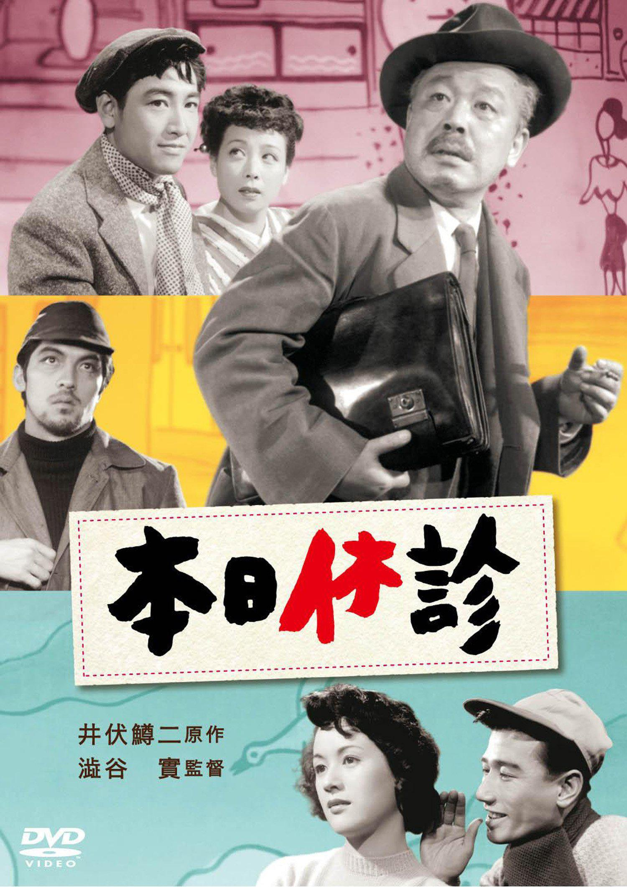

------

------

本日休诊 / 本日休診 (Honjitsu Kyushin / Doctor's Day Off) 是涩谷实于1952年导演，井伏鳟二原作，斋藤良輔脚本，吉泽博音乐，柳永二郎 / 佐田启二 / 角梨枝子 / 淡岛千景 / 鹤田浩二 / 三国连太郎主演的电影。英文字幕由coralsundy自费出资，jls001999听译制作完成。有少许错漏和语句不够流畅，可全程完整欣赏电影，适用于01:37:34的版本。由于电影年代久远，音轨质量一般，听译难免错漏，敬请谅解。

------

Honjitsu Kyushin / Doctor's Day Off  (1952) is a 1952 movie directed by Minoru Shibuya, with notable stars Eijiro Yanagi, Keiji Sada, Rieko Sumi, Chikage Awashima, Koji Tsuruta, and Rentaro Mikuni.

------

**Translation/Subtitle**: jls001999 (jls001999@gmail.com) 
**Review/Proofreading**: coralsundy (coralsundy@gmail.com) 
*(Paid by coralsundy for the translation, personal use only)*

------

**中文字幕**: 尚无 
**English Subtitle**: [Honjitsu.Kyushin.aka.Doctors.Day.Off.1952.eng.01-37-34.BYjls001999.rev1.srt](../subtitles/Honjitsu.Kyushin.aka.Doctors.Day.Off.1952.eng.01-37-34.BYjls001999.rev1.srt)

------

**SUBHD**: <https://subhd.tv/a/569498> 
**IMDB**: <https://www.imdb.com/title/tt0322592/> 
**DOUBAN**: <https://movie.douban.com/subject/2174524/>

------

**More Movie Subtitles on My Website**: <a href=''>CLICK HERE</a>

