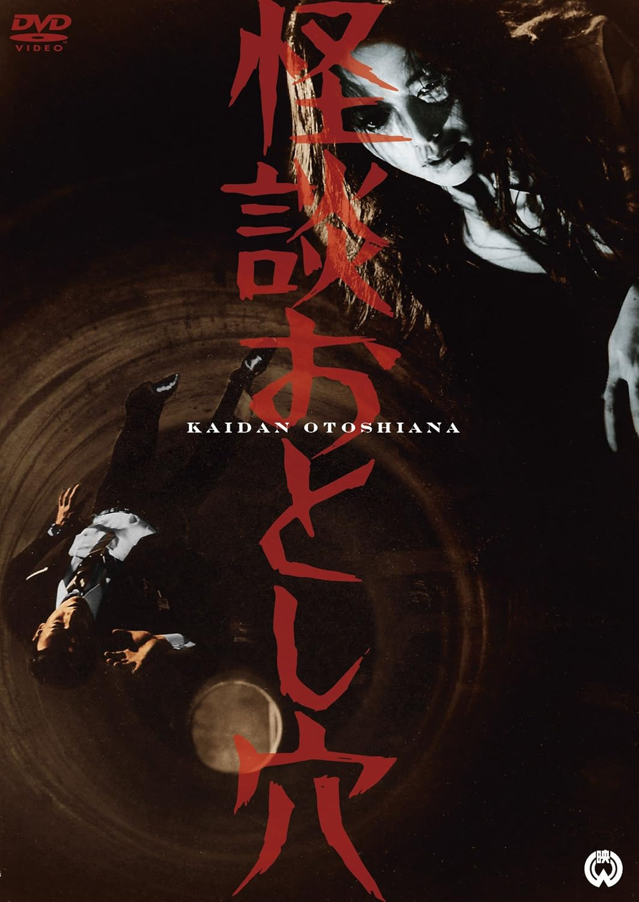

------

------

怪谈陷阱 / 怪談おとし穴 (Kaidan Otoshiana / The Ghostly Trap) 是岛耕二于1968年导演，舟桥和郎脚本，大森盛太郎音乐，渚真弓 / 成田三树夫 / 船越英二主演的电影。英文字幕由coralsundy自费出资，jls001999听译制作完成。有少许错漏和语句不够流畅，可全程完整欣赏电影，适用于01:17:55的版本。由于电影年代久远，音轨质量一般，听译难免错漏，敬请谅解。

------

Kaidan Otoshiana / The Ghostly Trap (1968) is a 1968 movie directed by Koji Shima, with notable stars Mayumi Nagisa, Mikio Narita, Eiji Funakoshi.

------

**Translation/Subtitle**: jls001999 (jls001999@gmail.com) 
**Review/Proofreading**: coralsundy (coralsundy@gmail.com) 
*(Paid by coralsundy for the translation, personal use only)*

------

**中文字幕**: 尚无 
**English Subtitle**: [Kaidan.Otoshiana.aka.The.Ghostly.Trap.1968.eng.01-17-55.BYjls001999.rev1.srt](../subtitles/Kaidan.Otoshiana.aka.The.Ghostly.Trap.1968.eng.01-17-55.BYjls001999.rev1.srt)

------

**SUBHD**: <https://subhd.tv/a/570118> 
**IMDB**: <https://www.imdb.com/title/tt0202958/> 
**DOUBAN**: <https://movie.douban.com/subject/4129409/>

------

**More Movie Subtitles on My Website**: <a href=''>CLICK HERE</a>

