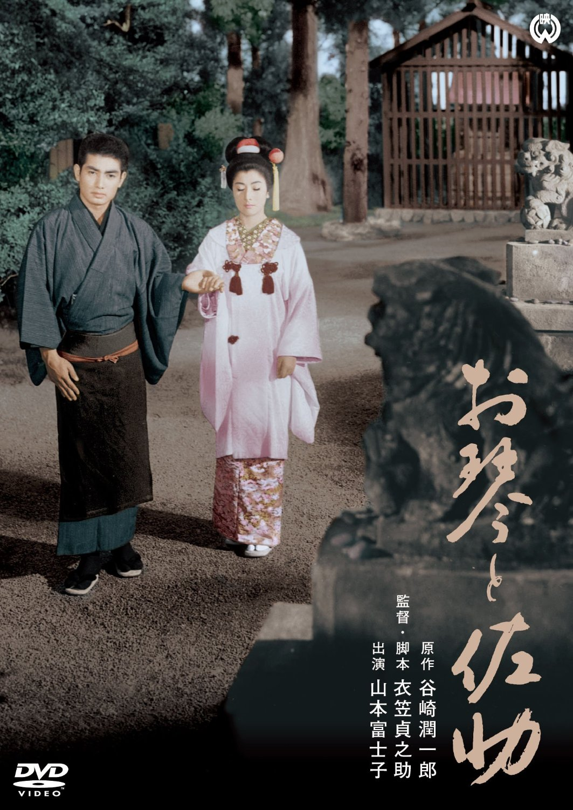

------

------

琴与佐助 / お琴と佐助 (Okoto to Sasuke) 是1961年衣笠贞之助监督并脚本创作，改编自谷崎润一郎原作《春琴抄》，齐藤一郎音乐，山本富士子 / 本乡功次郎主演的电影。中文字幕由coralsundy自费出资，moello听译制作，noela09审核润色。适用于01:34:01的版本。由于电影年代久远，音轨质量一般，听译难免错漏，敬请谅解。字幕仅供个人兴趣学习，不得商业化和付费。如有其他字幕翻译是基于我提供的字幕，敬请标明出处。

------

**No English Subtitle**

------

**听译/字幕**: moello (moello1909@outlook.com) 
**审核/润色**: noela09 (noela1990@outlook.com) 
**校对/调整**: coralsundy (coralsundy@gmail.com) 
*(由coralsundy自费出资制作, 仅供个人学习)*

------

**中文字幕**: [Okoto.to.Sasuke.1961.chs.01-34-01.BYmoello.rev1.srt](../subtitles/Okoto.to.Sasuke.1961.chs.01-34-01.BYmoello.rev1.srt) 
**English Subtitle**: None

------

**SUBHD**: <https://subhd.tv/a/570722> 
**IMDB**: <https://www.imdb.com/title/tt0055249/> 
**DOUBAN**: <https://movie.douban.com/subject/3136818/>

------

**More Movie Subtitles on My Website**: <a href=''>CLICK HERE</a>

