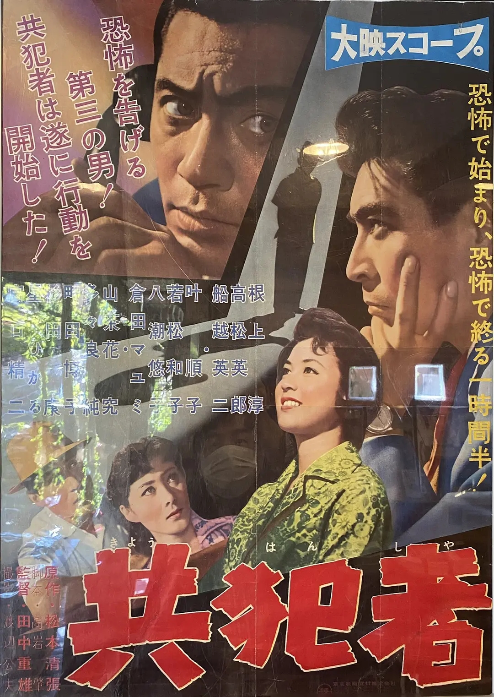

------

------

共犯者 (Kyohansha / Accomplice) 是田中重雄于1958年导演，松本清张原作，高岩肇脚本，古关裕而音乐，根上淳 / 船越英二 / 高松英郎 / 叶顺子主演的电影。英文字幕由coralsundy自费出资，jls001999听译制作完成。有少许错漏和语句不够流畅，可全程完整欣赏电影，适用于01:34:50的版本。由于电影年代久远，音轨质量一般，听译难免错漏，敬请谅解。

------

Kyohansha / Accomplice (1958) is a 1958 movie directed by Shigeo Tanaka, with notable stars Jun Negami, Eiji Funakoshi, Hideo Takamatsu, and Junko Kano.

------

**Translation/Subtitle**: jls001999 (jls001999@gmail.com) 
**Review/Proofreading**: coralsundy (coralsundy@gmail.com) 
*(Paid by coralsundy for the translation, personal use only)*

------

**中文字幕**: 尚无 
**English Subtitle**: [Kyohansha.aka.Accomplice.1958.eng.01-34-50.BYjls001999.rev1.srt](../subtitles/Kyohansha.aka.Accomplice.1958.eng.01-34-50.BYjls001999.rev1.srt)

------

**SUBHD**: <https://subhd.tv/a/572259> 
**IMDB**: <https://www.imdb.com/title/tt11625424/> 
**DOUBAN**: <https://movie.douban.com/subject/25796057/>

------

**More Movie Subtitles on My Website**: <a href=''>CLICK HERE</a>

