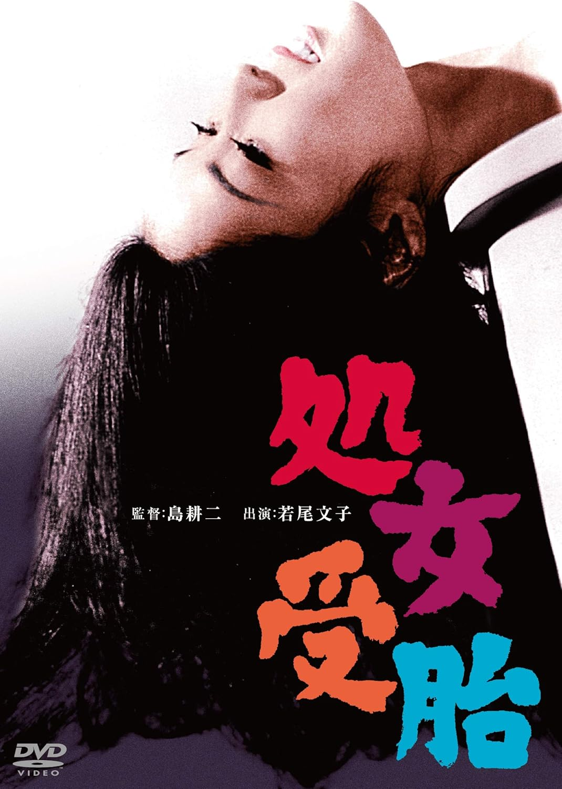

------

------

处女受胎 / 処女受胎 (Shojo Jutai) 是岛耕二于1966年导演，黑岩重吾原作，高岩肇脚本，大森胜太郎音乐，若尾文子 / 伊藤孝雄 / 中原早苗主演的电影。英文字幕由coralsundy自费出资，jls001999听译制作完成。有少许错漏和语句不够流畅，可全程完整欣赏电影，适用于01:22:12的版本。由于电影年代久远，音轨质量一般，听译难免错漏，敬请谅解。

------

Shojo Jutai (1966) is a 1966 movie directed by Koji Shima, with notable stars Ayako Wakao, Takao Ito, and Sanae Nakahara.

------

**Translation/Subtitle**: jls001999 (jls001999@gmail.com) 
**Review/Proofreading**: coralsundy (coralsundy@gmail.com) 
*(Paid by coralsundy for the translation, personal use only)*

------

**中文字幕**: 尚无 
**English Subtitle**: [Shojo.Jutai.1966.eng.01-22-12.jls001999.rev1.srt](../subtitles/Shojo.Jutai.1966.eng.01-22-12.jls001999.rev1.srt)

------

**SUBHD**: <https://subhd.tv/a/573552> 
**IMDB**: <https://www.imdb.com/title/tt0383633/> 
**DOUBAN**: <https://movie.douban.com/subject/3177004/>

------

**More Movie Subtitles on My Website**: <a href=''>CLICK HERE</a>

