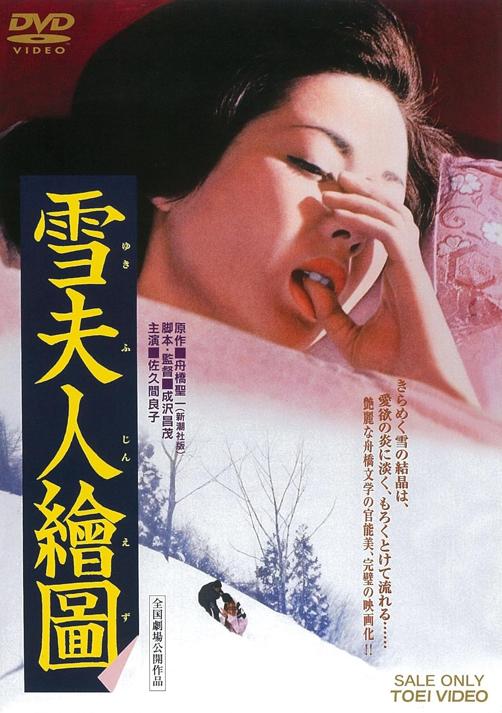

------

------

雪夫人绘图 / 雪夫人繪圖 (Yuki Fujin Ezu / Portrait of Madame Yuki) 是成泽昌茂于1968年导演(1975年公映)，舟桥圣一原作，成泽昌茂脚本，渡边岳夫音乐，佐久间良子 / 山形勋 / 丹波哲郎主演的电影。英文字幕由coralsundy自费出资，jls001999听译制作完成。有少许错漏和语句不够流畅，可全程完整欣赏电影，适用于01:30:11的版本。由于电影年代久远，音轨质量一般，听译难免错漏，敬请谅解。

------

Yuki Fujin Ezu / Portrait of Madame Yuki (1968) is a 1968 movie (released in 1975) directed by Masashige Narusawa, with notable stars Yoshiko Sakuma, Isao Yamagata, and Tetsuro Tanba.

------

**Translation/Subtitle**: jls001999 (jls001999@gmail.com) 
**Review/Proofreading**: coralsundy (coralsundy@gmail.com) 
*(Paid by coralsundy for the translation, personal use only)*

------

**中文字幕**: 尚无 
**English Subtitle**: [Yuki.Fujin.Ezu.aka.Portrait.of.Madame.Yuki.1968.eng.01-30-11.BYjls001999.rev1.srt](../subtitles/Yuki.Fujin.Ezu.aka.Portrait.of.Madame.Yuki.1968.eng.01-30-11.BYjls001999.rev1.srt)

------

**SUBHD**: <https://subhd.tv/a/574350> 
**IMDB**: <https://www.imdb.com/title/tt9417730/> 
**DOUBAN**: <https://movie.douban.com/subject/30242127/>

------

**More Movie Subtitles on My Website**: <a href=''>CLICK HERE</a>

