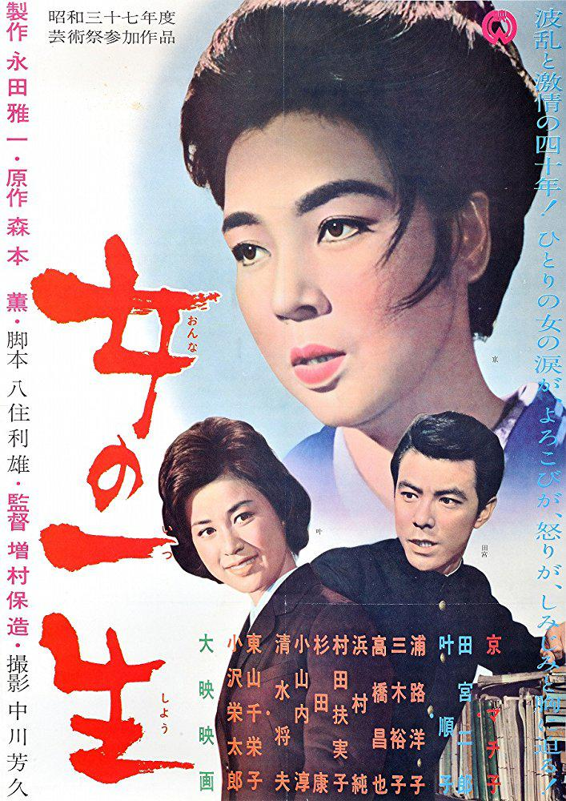

------

------

女人的一生 / 女の一生 (Onna no Issho / Life of a Woman) 是增村保造于1962年导演，森本薰原作，八住利雄脚本，池野成音乐，京町子 / 田宫二郎 / 叶顺子主演的电影。英文字幕由coralsundy自费出资，jls001999听译制作完成。有少许错漏和语句不够流畅，可全程完整欣赏电影，适用于01:33:34的版本。由于电影年代久远，音轨质量一般，听译难免错漏，敬请谅解。

------

Onna no Issho / Life of a Woman (1962) is a 1962 movie directed by Yasuzo Masumura, with notable stars Machiko Kyo, Jiro Tamiya, and Junko Kano.

------

**Translation/Subtitle**: jls001999 (jls001999@gmail.com) 
**Review/Proofreading**: coralsundy (coralsundy@gmail.com) 
*(Paid by coralsundy for the translation, personal use only)*

------

**中文字幕**: 尚无 
**English Subtitle**: [Onna.no.Issho.aka.Life.of.a.Woman.1962.eng.01-33-34.BYjls001999.rev1.srt](../subtitles/Onna.no.Issho.aka.Life.of.a.Woman.1962.eng.01-33-34.BYjls001999.rev1.srt)

------

**SUBHD**: <https://subhd.tv/a/574990> 
**IMDB**: <https://www.imdb.com/title/tt0261131/> 
**DOUBAN**: <https://movie.douban.com/subject/5139998/>

------

**More Movie Subtitles on My Website**: <a href=''>CLICK HERE</a>

