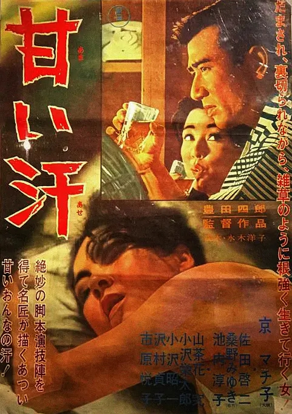

------

------

甜汗 / 甘い汗 (Amai Ase / Sweet Sweat) 是丰田四郎于1964年导演，水木洋子脚本，林光音乐，京町子 / 佐田启二 / 桑野美雪 / 小泽荣太郎主演的电影。英文字幕由coralsundy自费出资，jls001999听译制作完成。有少许错漏和语句不够流畅，可全程完整欣赏电影，适用于01:59:26的版本。由于电影年代久远，音轨质量一般，听译难免错漏，敬请谅解。

------

Amai Ase / Sweet Sweat (1964) is a 1964 movie directed by Shiro Toyoda, with notable stars Machiko Kyo, Keiji Sada, Miyuki Kuwano, and Eitaro Ozawa.

------

**Translation/Subtitle**: jls001999 (jls001999@gmail.com) 
**Review/Proofreading**: coralsundy (coralsundy@gmail.com) 
*(Paid by coralsundy for the translation, personal use only)*

------

**中文字幕**: 尚无 
**English Subtitle**: [Amai.Ase.aka.Sweet.Sweat.1964.eng.01-59-26.BYjls001999.rev1.srt](../subtitles/Amai.Ase.aka.Sweet.Sweat.1964.eng.01-59-26.BYjls001999.rev1.srt)

------

**SUBHD**: <https://subhd.tv/a/576338> 
**IMDB**: <https://www.imdb.com/title/tt0204129/> 
**DOUBAN**: <https://movie.douban.com/subject/4151078/>

------

**More Movie Subtitles on My Website**: <a href=''>CLICK HERE</a>

