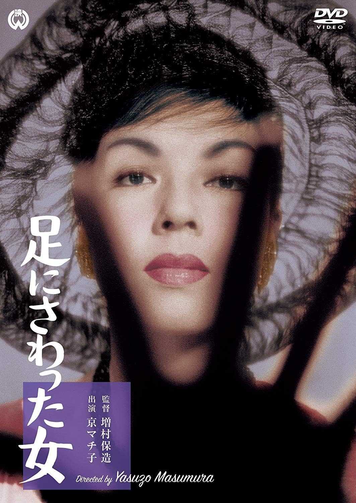

------

------

碰脚的女人 / 足にさわった女 (Ashi Ni Sawatta Onna / The Woman Who Touched the Legs) 是增村保造于1960年导演，和田夏十 / 市川昆共同脚本，塚原晢夫音乐，京町子 / 鼻肇 / 船越英二 / 田宫二郎主演的电影。英文字幕由coralsundy自费出资，jls001999听译制作完成。有少许错漏和语句不够流畅，可全程完整欣赏电影，适用于01:25:15的版本。由于电影年代久远，音轨质量一般，听译难免错漏，敬请谅解。

------

Ashi Ni Sawatta Onna / The Woman Who Touched the Legs (1960) is a 1960 movie directed by Yasuzo Masumura, with notable stars Machiko Kyo, Hajime Hana, Eiji Funakoshi, and Jiro Tamiya.

------

**Translation/Subtitle**: jls001999 (jls001999@gmail.com) 
**Review/Proofreading**: coralsundy (coralsundy@gmail.com) 
*(Paid by coralsundy for the translation, personal use only)*

------

**中文字幕**: 尚无 
**English Subtitle**: [Ashi.Ni.Sawatta.Onna.aka.The.Woman.Who.Touched.the.Legs.1960.eng.01-25-15.BYjls001999.rev1.srt](../subtitles/Ashi.Ni.Sawatta.Onna.aka.The.Woman.Who.Touched.the.Legs.1960.eng.01-25-15.BYjls001999.rev1.srt)

------

**SUBHD**: <https://subhd.tv/a/578183> 
**IMDB**: <https://www.imdb.com/title/tt0228035/> 
**DOUBAN**: <https://movie.douban.com/subject/3169334/>

------

**More Movie Subtitles on My Website**: <a href=''>CLICK HERE</a>

