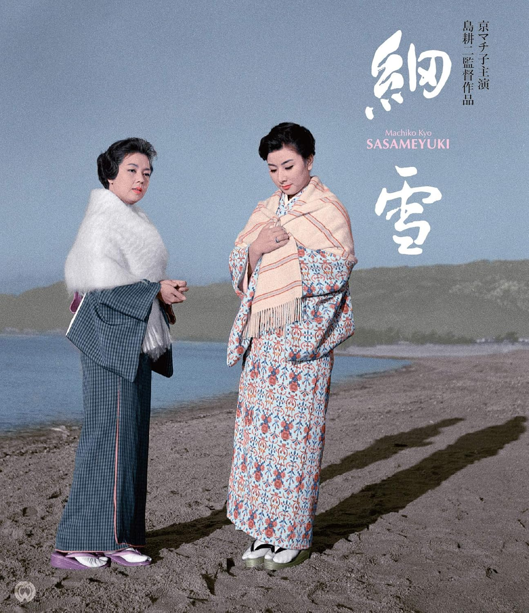

------

------

细雪 / 細雪 (Sasameyuki / The Makioka Sisters) 是岛耕二于1959年导演，谷崎润一郎原作，八住利雄脚本，大森盛太郎音乐，京町子 / 山本富士子 / 叶顺子主演的电影。英文字幕由coralsundy自费出资，jls001999听译制作完成。有少许错漏和语句不够流畅，可全程完整欣赏电影，适用于01:45:02的版本。由于电影年代久远，音轨质量一般，听译难免错漏，敬请谅解。

------

Sasameyuki / The Makioka Sisters (1959) is a 1959 movie directed by Koji Shima, with notable stars Machiko Kyo, Fujiko Yamamoto, and Junko Kano.

------

**Translation/Subtitle**: jls001999 (jls001999@gmail.com) 
**Review/Proofreading**: coralsundy (coralsundy@gmail.com) 
*(Paid by coralsundy for the translation, personal use only)*

------

**中文字幕**: 尚无 
**English Subtitle**: [Sasameyuki.aka.The.Makioka.Sisters.1959.eng.01-45-02.jls001999.rev1.srt](../subtitles/Sasameyuki.aka.The.Makioka.Sisters.1959.eng.01-45-02.jls001999.rev1.srt)

------

**SUBHD**: <https://subhd.tv/a/579246> 
**IMDB**: <https://www.imdb.com/title/tt0426202/> 
**DOUBAN**: <https://movie.douban.com/subject/3136822/>

------

**More Movie Subtitles on My Website**: <a href=''>CLICK HERE</a>

