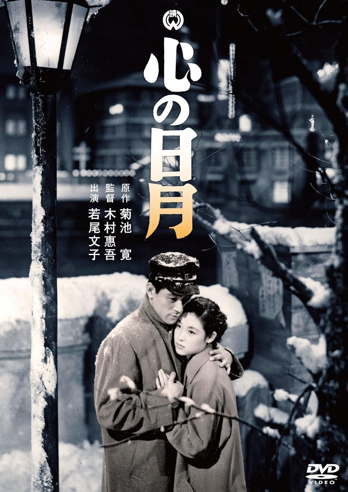

------

------

心之日月 / 心の日月 (Kokoro no Nichigetsu) 是木村恵吾于1954年导演，菊池宽原作，木村惠吾 / 田辺朝二共同脚本，米山正夫音乐，若尾文子 / 菅原谦二主演的电影。英文字幕由coralsundy自费出资，jls001999听译制作完成。有少许错漏和语句不够流畅，可全程完整欣赏电影，适用于01:31:11的版本。由于电影年代久远，音轨质量一般，听译难免错漏，敬请谅解。

------

Kokoro no Nichigetsu (1954) is a 1954 movie directed by Keigo Kimura, with notable stars Ayako Wakao and Kenji Sugawara.

------

**Translation/Subtitle**: jls001999 (jls001999@gmail.com) 
**Review/Proofreading**: coralsundy (coralsundy@gmail.com) 
*(Paid by coralsundy for the translation, personal use only)*

------

**中文字幕**: 尚无 
**English Subtitle**: [Kokoro.no.Nichigetsu.1954.eng.01-31-11.BYjls001999.rev1.srt](../subtitles/Kokoro.no.Nichigetsu.1954.eng.01-31-11.BYjls001999.rev1.srt)

------

**SUBHD**: <https://subhd.tv/a/580098> 
**IMDB**: <https://www.imdb.com/title/tt22013136/> 
**DOUBAN**: <https://movie.douban.com/subject/26987977/>

------

**More Movie Subtitles on My Website**: <a href=''>CLICK HERE</a>

