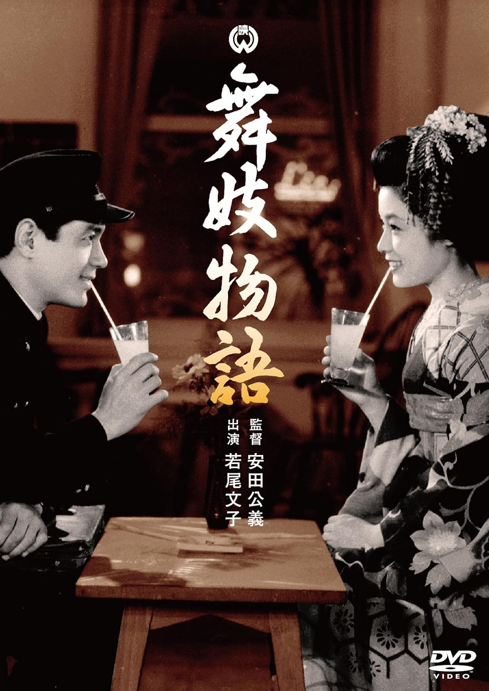

------

------

舞妓物语 / 舞妓物語 (Maiko Monogatari) 是安田公义于1954年导演，川口松太郎原作，若尾德平 / 八尋桜児共同脚本，大久保德二郎音乐，根上淳 / 若尾文子主演的电影。英文字幕由coralsundy自费出资，jls001999听译制作完成。有少许错漏和语句不够流畅，可全程完整欣赏电影，适用于01:32:04的版本。由于电影年代久远，音轨质量一般，听译难免错漏，敬请谅解。

------

Maiko Monogatari (1954) is a 1954 movie directed by Kimiyoshi Yasuda, with notable stars Jun Negami and Ayako Wakao.

------

**Translation/Subtitle**: jls001999 (jls001999@gmail.com) 
**Review/Proofreading**: coralsundy (coralsundy@gmail.com) 
*(Paid by coralsundy for the translation, personal use only)*

------

**中文字幕**: 尚无 
**English Subtitle**: [Maiko.Monogatari.1954.eng.01-32-04.BYjls001999.rev1.srt](../subtitles/Maiko.Monogatari.1954.eng.01-32-04.BYjls001999.rev1.srt)

------

**SUBHD**: <https://subhd.tv/a/581075> 
**IMDB**: <https://www.imdb.com/title/tt22177972/> 
**DOUBAN**: <https://movie.douban.com/subject/26987978/>

------

**More Movie Subtitles on My Website**: <a href=''>CLICK HERE</a>

