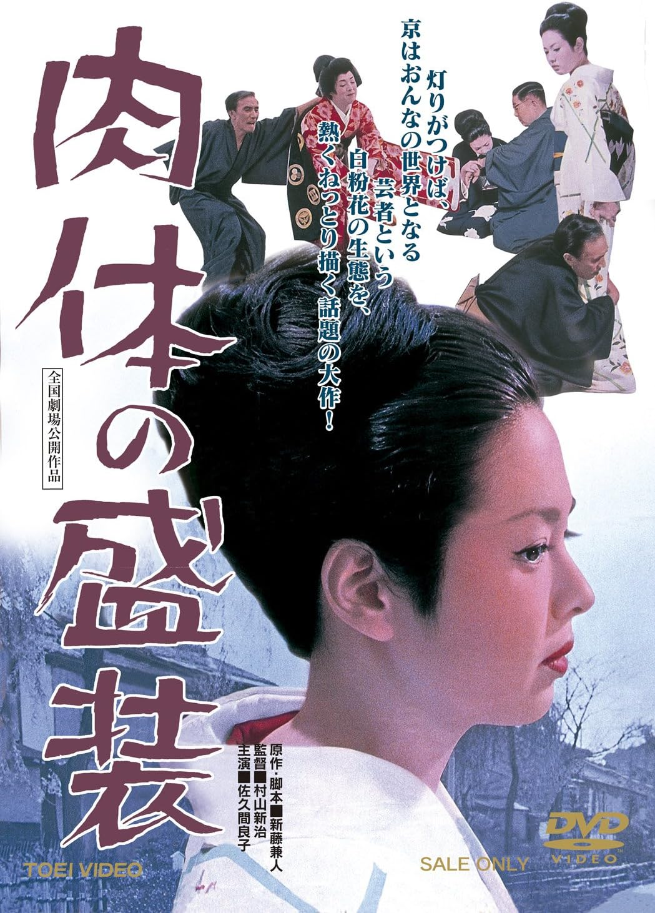

------

------

肉体的盛装 / 肉体の盛装 (Nikutai no Seiso / The Gorgeous Geisha) 是村山新治于1964年导演，新藤兼人原作和脚本，池野成音乐，佐久间良子 / 藤纯子 / 西村晃主演的电影。英文字幕由coralsundy自费出资，jls001999听译制作完成。有少许错漏和语句不够流畅，可全程完整欣赏电影，适用于01:26:44的版本。由于电影年代久远，音轨质量一般，听译难免错漏，敬请谅解。

------

Nikutai no Seiso / The Gorgeous Geisha (1964) is a 1964 movie directed by Shinji Murayama, with notable stars Yoshiko Sakuma, Sumiko Fuji, and Ko Nishimura.

------

**Translation/Subtitle**: jls001999 (jls001999@gmail.com) 
**Review/Proofreading**: coralsundy (coralsundy@gmail.com) 
*(Paid by coralsundy for the translation, personal use only)*

------

**中文字幕**: 尚无 
**English Subtitle**: [Nikutai.no.Seiso.aka.The.Gorgeous.Geisha.1964.eng.01-26-44.BYjls001999.rev1.srt](../subtitles/Nikutai.no.Seiso.aka.The.Gorgeous.Geisha.1964.eng.01-26-44.BYjls001999.rev1.srt)

------

**SUBHD**: <https://subhd.tv/a/583207> 
**IMDB**: <https://www.imdb.com/title/tt0358608/> 
**DOUBAN**: <https://movie.douban.com/subject/26687292/>

------

**More Movie Subtitles on My Website**: <a href=''>CLICK HERE</a>

