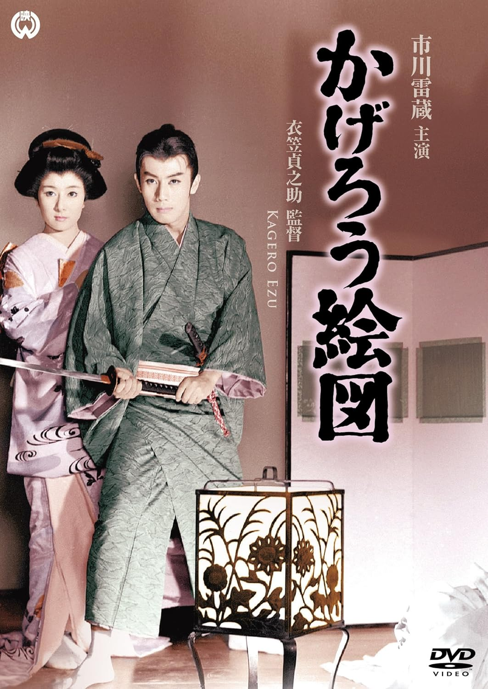

------

------

阳炎图 / かげろう絵図 (Kagero Ezu / Stop the Old Fox) 是衣笠贞之助于1959年导演，松本清张原作，衣笠贞之助 / 犬塚稔共同脚本，齐藤一郎音乐，市川雷蔵 / 山本富士子 / 泷泽修主演的电影。英文字幕由coralsundy自费出资，jls001999听译制作完成。有少许错漏和语句不够流畅，可全程完整欣赏电影，适用于01:57:23的版本。由于电影年代久远，音轨质量一般，听译难免错漏，敬请谅解。

------

Kagero Ezu / Stop the Old Fox (1959) is a 1959 movie directed by Teinosuke Kinugasa, with notable stars Raizo Ichikawa, Fujiko Yamamoto, and Osamu Takizawa.

------

**Translation/Subtitle**: jls001999 (jls001999@gmail.com) 
**Review/Proofreading**: coralsundy (coralsundy@gmail.com) 
*(Paid by coralsundy for the translation, personal use only)*

------

**中文字幕**: 尚无 
**English Subtitle**: [Kagero.Ezu.aka.Stop.the.Old.Fox.1959.1080p.eng.01-57-23.BYjls001999.rev1.srt](../subtitles/Kagero.Ezu.aka.Stop.the.Old.Fox.1959.1080p.eng.01-57-23.BYjls001999.rev1.srt)

------

**SUBHD**: <https://subhd.tv/a/584489> 
**IMDB**: <https://www.imdb.com/title/tt0052956/> 
**DOUBAN**: <https://movie.douban.com/subject/2993706/>

------

**More Movie Subtitles on My Website**: <a href=''>CLICK HERE</a>

