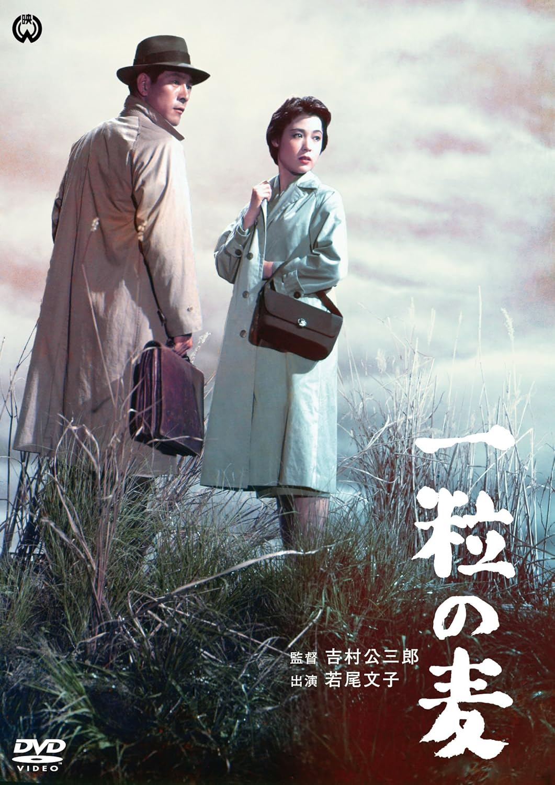

------

------

一粒麦 / 一粒の麦 (Hitotsubu no Mugi / A Grain of Wheat) 是吉村公三郎于1958年导演，新藤兼人 / 千叶茂树共同脚本，池野成音乐，菅原谦二 / 若尾文子 / 东野英治郎主演的电影。英文字幕由coralsundy自费出资，jls001999听译制作完成。有少许错漏和语句不够流畅，可全程完整欣赏电影，适用于01:49:26的版本。由于电影年代久远，音轨质量一般，听译难免错漏，敬请谅解。

------

Hitotsubu no Mugi / A Grain of Wheat (1958) is a 1958 movie directed by Kozaburo Yoshimura, with notable stars Kenji Sugawara, Ayako Wakao, and Eijiro Tono.

------

**Translation/Subtitle**: jls001999 (jls001999@gmail.com) 
**Review/Proofreading**: coralsundy (coralsundy@gmail.com) 
*(Paid by coralsundy for the translation, personal use only)*

------

**中文字幕**: 尚无 
**English Subtitle**: [Hitotsubu.no.Mugi.aka.A.Grain.of.Wheat.1958.eng.01-49-26.BYjls001999.rev1.srt](../subtitles/Hitotsubu.no.Mugi.aka.A.Grain.of.Wheat.1958.eng.01-49-26.BYjls001999.rev1.srt)

------

**SUBHD**: <https://subhd.tv/a/589305> 
**IMDB**: <https://www.imdb.com/title/tt0943435/> 
**DOUBAN**: <https://movie.douban.com/subject/3011611/>

------

**More Movie Subtitles on My Website**: <a href=''>CLICK HERE</a>

