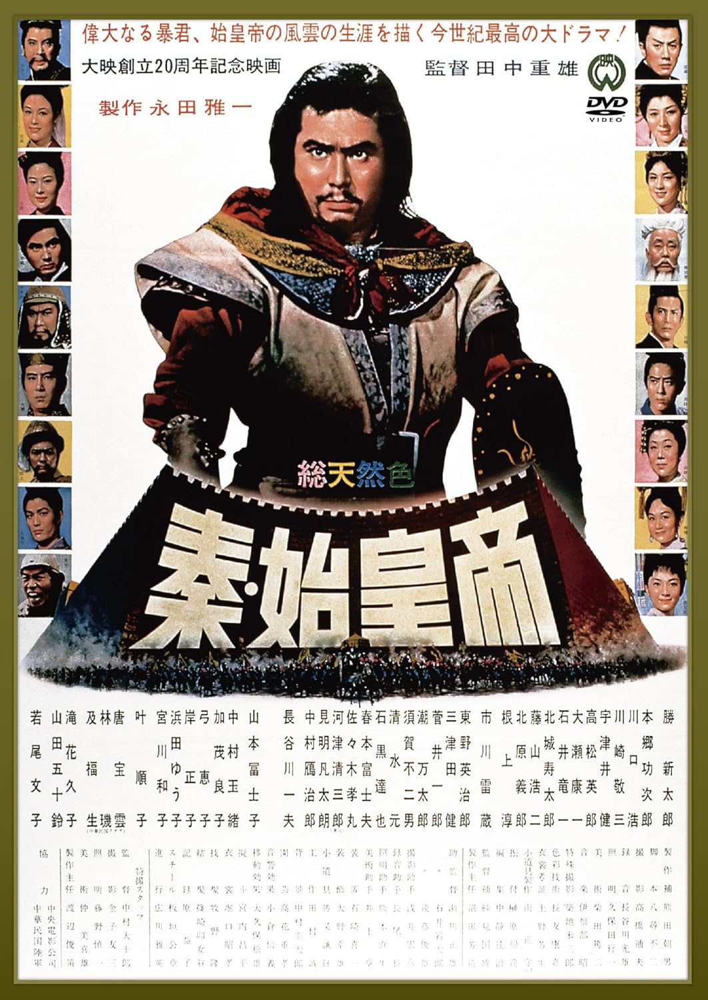

------

------

秦始皇帝 (Shin Shikotei / The Great Wall) 是1962年田中重雄总监督，中村大十郎特摄监督，八寻不二剧本，伊福部昭音乐，胜新太郎 / 本乡功次郎 / 市川雷藏 / 山田五十铃 / 山本富士子 / 长谷川一夫 / 川口浩 / 川崎敬三 / 宇津井健 / 高松英郎 / 根上淳 / 东野英治郎 / 中村玉绪 / 叶顺子 / 若尾文子主演的电影。中文字幕由coralsundy自费出资，moello听译制作，noela09审核润色。适用于02:39:43的dvd版本。高清源需要自行修改时间轴。由于电影年代久远，音轨质量一般，听译难免错漏，敬请谅解。

------

**No English Subtitle**

------

**听译/字幕**: moello (moello1909@outlook.com) 
**审核/润色**: noela09 (noela1990@outlook.com) 
**校对/调整**: coralsundy (coralsundy@gmail.com) 
*(以老版dvd字幕为基础，biao76原始字幕转录校对)*
*(moello新增翻译，二次校对错漏，制作最终版本)*
*(由coralsundy自费出资制作, 仅供个人学习)*

------

**中文字幕**: [Shin.Shikotei.aka.The.Great.Wall.1962.chs.02-39-43.BYmoello.rev1.srt](../subtitles/Shin.Shikotei.aka.The.Great.Wall.1962.chs.02-39-43.BYmoello.rev1.srt) 
**English Subtitle**: None

------

**SUBHD**: <https://subhd.tv/a/589472> 
**IMDB**: <https://www.imdb.com/title/tt0056492/> 
**DOUBAN**: <https://movie.douban.com/subject/1306768/>

------

**More Movie Subtitles on My Website**: <a href=''>CLICK HERE</a>

