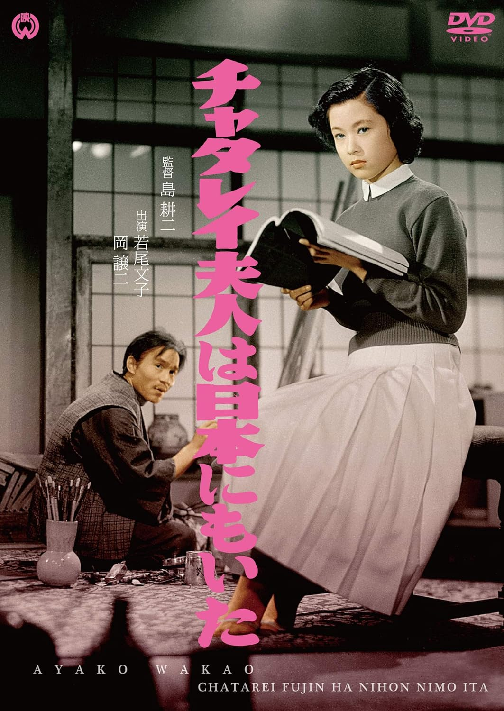

------

------

日本的查泰莱夫人 / チャタレイ夫人は日本にもいた (Chatterley Fujin wa Nihon Nimo Ita / Lady Chatterley of Japan) 是岛耕二于1953年导演，川口松太郎原作，八住利雄脚本，大森盛太郎音乐， 轰夕起子 / 若尾文子 / 冈让司 / 宇野重吉主演的电影。英文字幕由coralsundy自费出资，jls001999听译制作完成。有少许错漏和语句不够流畅，可全程完整欣赏电影，适用于01:28:46的版本。由于电影年代久远，音轨质量一般，听译难免错漏，敬请谅解。

------

Chatterley Fujin wa Nihon Nimo Ita / Lady Chatterley of Japan (1953) is a 1953 movie directed by Koji Shima, with notable stars Yukiko Todoroki, Ayako Wakao, Joji Oka, and Jukichi Uno.

------

**Translation/Subtitle**: jls001999 (jls001999@gmail.com) 
**Review/Proofreading**: coralsundy (coralsundy@gmail.com) 
*(Paid by coralsundy for the translation, personal use only)*

------

**中文字幕**: 尚无 
**English Subtitle**: [Chatterley.Fujin.wa.Nihon.Nimo.Ita.aka.Lady.Chatterley.of.Japan.1953.eng.01-28-46.BYjls001999.rev1.srt](../subtitles/Chatterley.Fujin.wa.Nihon.Nimo.Ita.aka.Lady.Chatterley.of.Japan.1953.eng.01-28-46.BYjls001999.rev1.srt)

------

**SUBHD**: <https://subhd.tv/a/590724> 
**IMDB**: <https://www.imdb.com/title/tt5162934/> 
**DOUBAN**: <https://movie.douban.com/subject/26687346/>

------

**More Movie Subtitles on My Website**: <a href=''>CLICK HERE</a>

