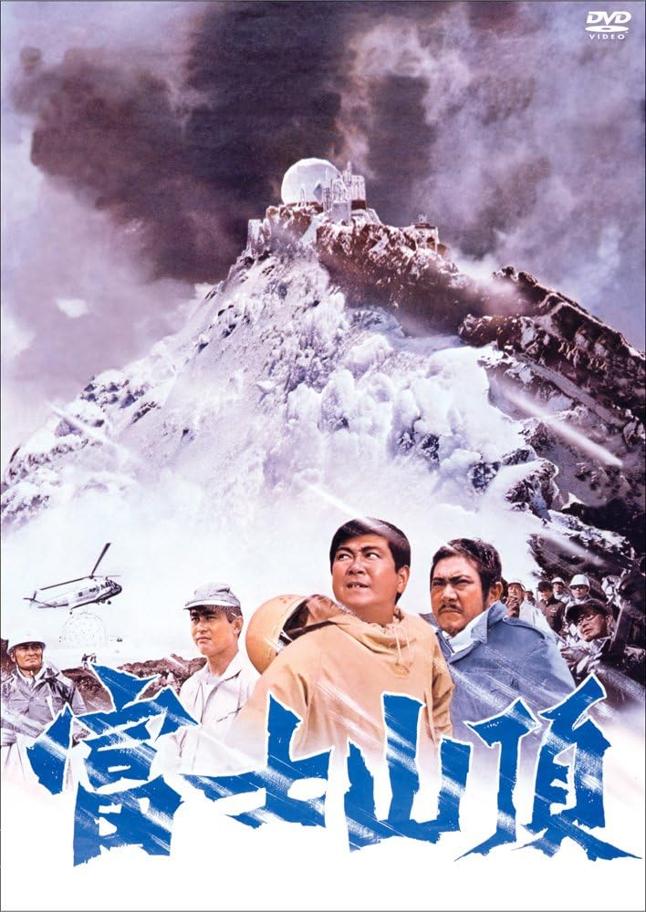

------

------

富士山顶 / 富士山頂 (Fuji Sancho / The Summit of Mt Fuji) 是1970年村野铁太郎监督，新田次郎原作，国弘威雄剧本，黛敏郎音乐，石原裕次郎 / 山崎努 / 渡哲也主演的电影。中文字幕由coralsundy自费出资，moello听译制作，noela09审核润色。适用于02:05:54的版本。由于电影年代久远，音轨质量一般，听译难免错漏，敬请谅解。

------

**No English Subtitle**

------

**听译/字幕**: moello (moello1909@outlook.com) 
**审核/润色**: noela09 (noela1990@outlook.com) 
**校对/调整**: coralsundy (coralsundy@gmail.com) 
*(由coralsundy自费出资制作, 仅供个人学习)*

------

**中文字幕**: [Fuji.Sancho.aka.The.Summit.of.Mt.Fuji.1970.chs.02-05-54.BYmoello.rev1.srt](../subtitles/Fuji.Sancho.aka.The.Summit.of.Mt.Fuji.1970.chs.02-05-54.BYmoello.rev1.srt) 
**English Subtitle**: None

------

**SUBHD**: <https://subhd.tv/a/591904> 
**IMDB**: <https://www.imdb.com/title/tt1097232/> 
**DOUBAN**: <https://movie.douban.com/subject/5190015/>

------

**More Movie Subtitles on My Website**: <a href=''>CLICK HERE</a>

