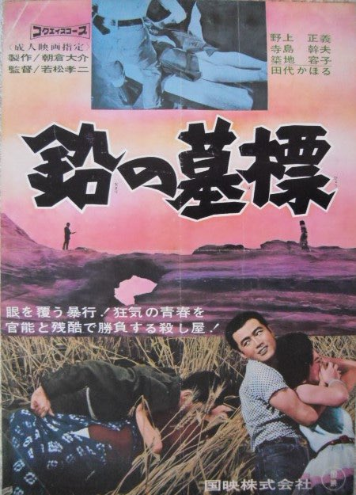

------

------

铅的墓碑 / 鉛の墓標 (Namari no Bohyo / Lead Tombstone) 是若松孝二于1964年导演，吉冈道夫脚本，大竹村次郎音乐， 野上正义 / 田代かほる主演的电影。英文字幕由coralsundy自费出资，jls001999听译制作完成。有少许错漏和语句不够流畅，可全程完整欣赏电影，适用于01:26:02的版本。由于电影年代久远，音轨质量一般，听译难免错漏，敬请谅解。

------

Namari no Bohyo / Lead Tombstone (1964) is a 1964 movie directed by Koji Wakamatsu, with notable stars Masayoshi Nogami and Tashiro Kahoru.

------

**Translation/Subtitle**: jls001999 (jls001999@gmail.com) 
**Review/Proofreading**: coralsundy (coralsundy@gmail.com) 
*(Paid by coralsundy for the translation, personal use only)*

------

**中文字幕**: 尚无 
**English Subtitle**: [Namari.no.Bohyo.aka.Lead.Tombstone.1964.eng.01-26-02.BYjls001999.rev1.srt](../subtitles/Namari.no.Bohyo.aka.Lead.Tombstone.1964.eng.01-26-02.BYjls001999.rev1.srt)

------

**SUBHD**: <https://subhd.tv/a/592989> 
**IMDB**: <https://www.imdb.com/title/tt0291373/> 
**DOUBAN**: <https://movie.douban.com/subject/5504166/>

------

**More Movie Subtitles on My Website**: <a href=''>CLICK HERE</a>

