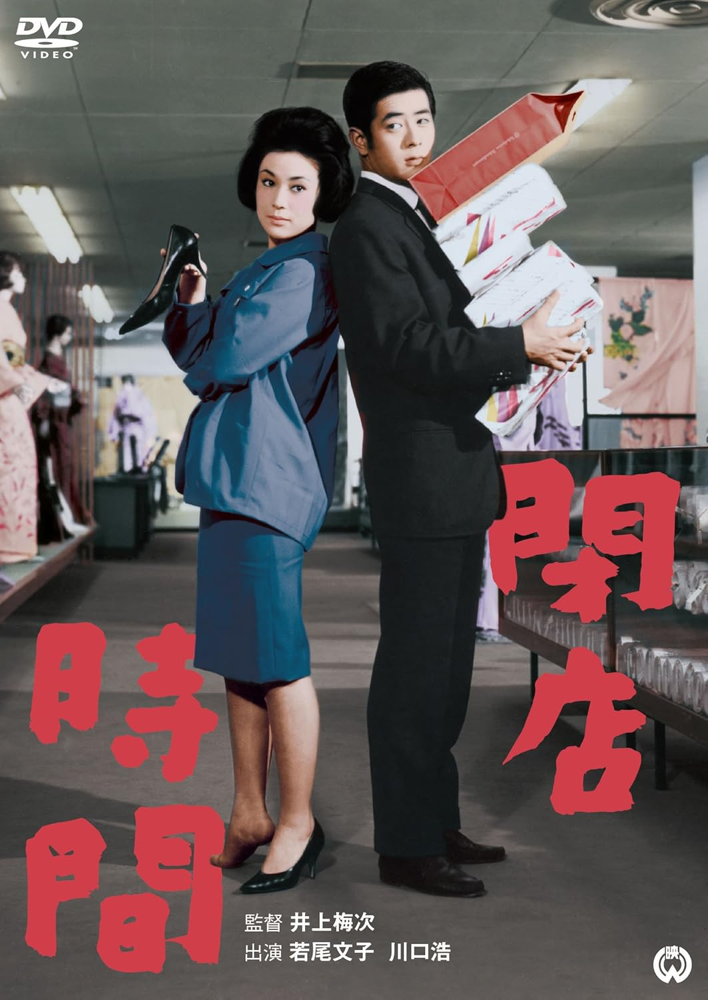

------

------

闭店时间 / 閉店時間 (Heiten Jikan / Closing Time) 是井上梅次于1962年导演，有吉佐和子原作，白坂依志夫脚本，中村八大音乐，若尾文子 / 川口浩 / 野添瞳 / 江波杏子 / 川崎敬三 / 大木実主演的电影。英文字幕由coralsundy自费出资，jls001999听译制作完成。有少许错漏和语句不够流畅，可全程完整欣赏电影，适用于01:39:37的版本。由于电影年代久远，音轨质量一般，听译难免错漏，敬请谅解。

------

Heiten Jikan / Closing Time (1962) is a 1962 movie directed by Umetsugu Inoue, with notable stars Ayako Wakao, Hiroshi Kawaguchi, Hitomi Nozoe, Keizo Kawasaki, and Minoru Oki.

------

**Translation/Subtitle**: jls001999 (jls001999@gmail.com) 
**Review/Proofreading**: coralsundy (coralsundy@gmail.com) 
*(Paid by coralsundy for the translation, personal use only)*

------

**中文字幕**: 尚无 
**English Subtitle**: [Heiten.Jikan.aka.Closing.Time.1962.eng.01-39-37.BYjls001999.rev1.srt](../subtitles/Heiten.Jikan.aka.Closing.Time.1962.eng.01-39-37.BYjls001999.rev1.srt)

------

**SUBHD**: <https://subhd.tv/a/597336> 
**IMDB**: <https://www.imdb.com/title/tt0384160/> 
**DOUBAN**: <https://movie.douban.com/subject/25785973/>

------

**More Movie Subtitles on My Website**: <a href=''>CLICK HERE</a>

