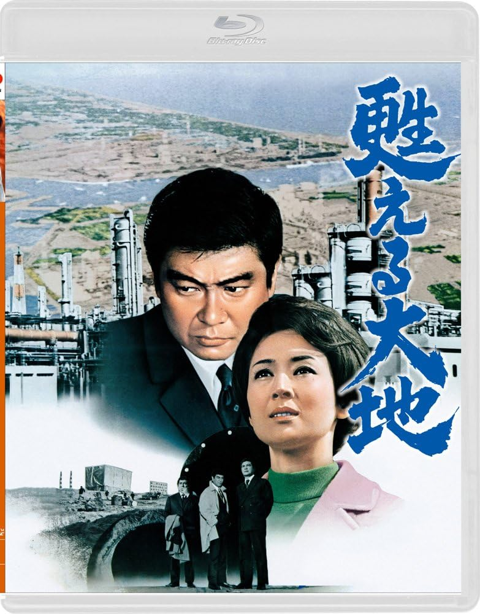

------

------

复活的大地 / 甦える大地 (Yomigaeru Daichi / The Earth is Born Again) 是1971年中村登监督，木本正次原作，猪又憲吾剧本，武满彻音乐，石原裕次郎 / 司叶子 / 三国连太郎 / 志村乔 / 泷泽修 / 渡哲也主演的电影。中文字幕由coralsundy自费出资，moello听译制作，noela09审核润色。适用于02:00:05的版本。由于电影年代久远，音轨质量一般，听译难免错漏，敬请谅解。

------

**No English Subtitle**

------

**听译/字幕**: moello (moello1909@outlook.com) 
**审核/润色**: noela09 (noela1990@outlook.com) 
**校对/调整**: coralsundy (coralsundy@gmail.com) 
*(由coralsundy自费出资制作, 仅供个人学习)*

------

**中文字幕**: [Yomigaeru.Daichi.aka.The.Earth.is.Born.Again.1971.chs.02-00-05.BYmoello.rev1.srt](../subtitles/Yomigaeru.Daichi.aka.The.Earth.is.Born.Again.1971.chs.02-00-05.BYmoello.rev1.srt) 
**English Subtitle**: None

------

**SUBHD**: <https://subhd.tv/a/598628> 
**IMDB**: <https://www.imdb.com/title/tt2638160/> 
**DOUBAN**: <https://movie.douban.com/subject/26688191/>

------

**More Movie Subtitles on My Website**: <a href=''>CLICK HERE</a>

