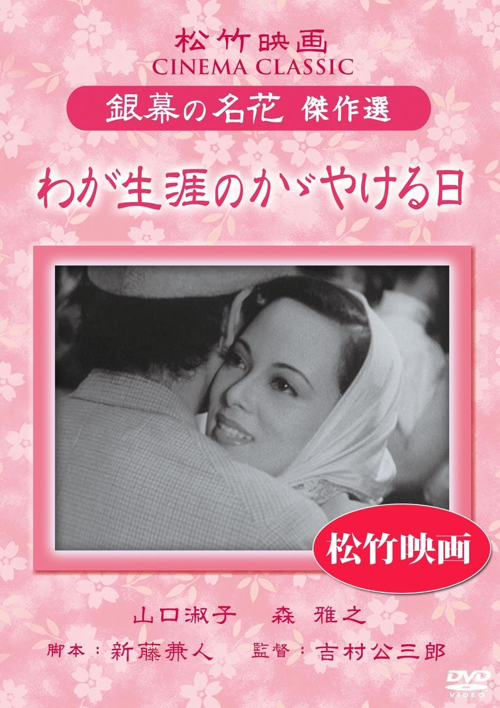

------

------

一生中最光辉的日子 / わが生涯のかがやける日 (Waga Shogai no Hagayakeru Hi / The Brightest Day of My Life) 是吉村公三郎于1948年导演，新藤兼人脚本，木下忠司 / 吉沢博音乐，森雅之 / 山口淑子(李香兰) / 泷泽修 / 宇野重吉 / 加藤嘉主演的电影。英文字幕由coralsundy自费出资，jls001999听译制作完成。有少许错漏和语句不够流畅，可全程完整欣赏电影，适用于01:40:59的版本。由于电影年代久远，音轨质量一般，听译难免错漏，敬请谅解。

------

Waga Shogai no Hagayakeru Hi / The Brightest Day of My Life (1948) is a 1948 movie directed by Kozaburo Yoshimura, with notable stars Masayuki Mori, Yoshiko Yamaguchi(Li Hsiang-lan), Osamu Takizawa, Jukichi Uno, and Yoshi Kato.

------

**Translation/Subtitle**: jls001999 (jls001999@gmail.com) 
**Review/Proofreading**: coralsundy (coralsundy@gmail.com) 
*(Paid by coralsundy for the translation, personal use only)*

------

**中文字幕**: 尚无 
**English Subtitle**: [Waga.Shogai.no.Hagayakeru.Hi.aka.The.Brightest.Day.of.My.Life.1948.eng.01-40-59.BYjls001999.rev1.srt](../subtitles/Waga.Shogai.no.Hagayakeru.Hi.aka.The.Brightest.Day.of.My.Life.1948.eng.01-40-59.BYjls001999.rev1.srt)

------

**SUBHD**: <https://subhd.tv/a/600064> 
**IMDB**: <https://www.imdb.com/title/tt0183996/> 
**DOUBAN**: <https://movie.douban.com/subject/2148321/>

------

**More Movie Subtitles on My Website**: <a href=''>CLICK HERE</a>

