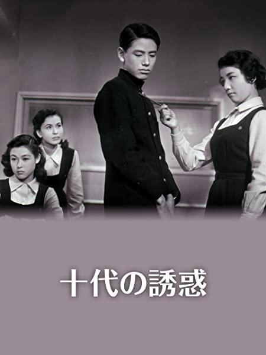

------

------

十代的诱惑 / 十代の誘惑 (Judai no Yuwaku) 是久松静儿于1953年导演，须崎胜弥脚本，饭田三郎音乐，若尾文子 / 南田洋子 / 山本富士子 / 根上淳 / 船越英二 / 菅原谦二主演的电影，是十代系列的第4部电影。英文字幕由coralsundy自费出资，jls001999听译制作完成。有少许错漏和语句不够流畅，可全程完整欣赏电影，适用于01:26:32的版本。由于电影年代久远，音轨质量一般，听译难免错漏，敬请谅解。

------

Judai no Yuwaku (1953) is a 1953 movie directed by Seiji Hisamatsu, with notable stars Ayako Wakao, Yoko Minamida, Fujiko Yamamoto, Jun Negami, Eiji Funakoshi, and Ichiro Sugai. It is the 4th movie in the Judai series.

------

**Translation/Subtitle**: jls001999 (jls001999@gmail.com) 
**Review/Proofreading**: coralsundy (coralsundy@gmail.com) 
*(Paid by coralsundy for the translation, personal use only)*

------

**中文字幕**: 尚无 
**English Subtitle**: [Judai.no.Yuwaku.1953.eng.01-26-32.BYjls001999.rev1.srt](../subtitles/Judai.no.Yuwaku.1953.eng.01-26-32.BYjls001999.rev1.srt)

------

**SUBHD**: <https://subhd.tv/a/4t6PDO> 
**IMDB**: <https://www.imdb.com/title/tt21307002/> 
**DOUBAN**: <https://movie.douban.com/subject/34809349/>

------

**More Movie Subtitles on My Website**: <a href=''>CLICK HERE</a>

