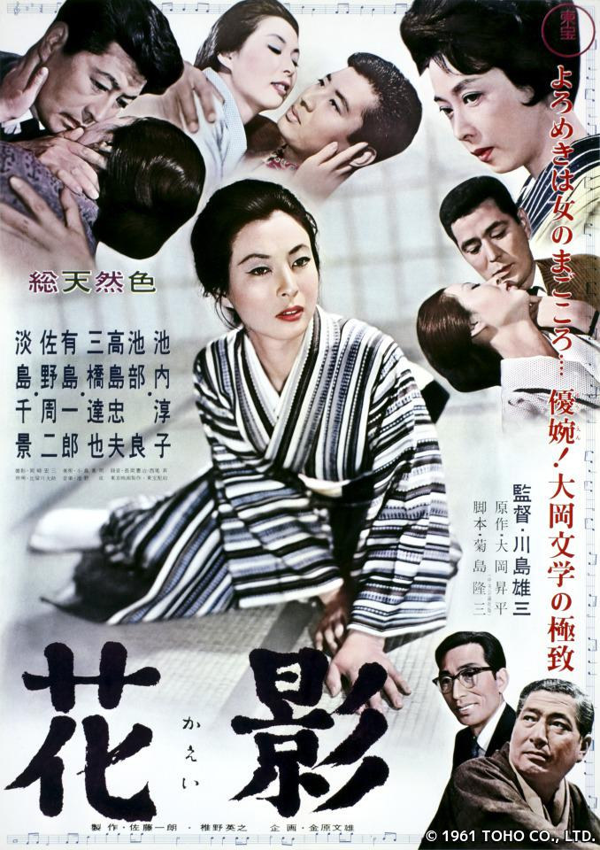

------

------

花影 (Kaei / Shadow of a Flower) 是川岛雄三于1961年导演，菊岛隆三脚本，大冈昇平原作，池野成音乐，池内淳子 / 佐野周二 / 池部良主演的电影。英文字幕由coralsundy自费出资，jls001999听译制作完成。有少许错漏和语句不够流畅，可全程完整欣赏电影，适用于01:38:54的版本。由于电影年代久远，音轨质量一般，听译难免错漏，敬请谅解。

------

Kaei / Shadow of a Flower (1961) is a 1961 movie directed by Ryuzo Kikushima, with notable stars Junko Ikeuchi, Shuji Sano, and Ryo Ikebe.

------

**Translation/Subtitle**: jls001999 (jls001999@gmail.com) 
**Review/Proofreading**: coralsundy (coralsundy@gmail.com) 
*(Paid by coralsundy for the translation, personal use only)*

------

**中文字幕**: 尚无 
**English Subtitle**: [Kaei.aka.Shadow.of.a.Flower.1961.eng.01-38-54.BYjls001999.rev1.srt](../subtitles/Kaei.aka.Shadow.of.a.Flower.1961.eng.01-38-54.BYjls001999.rev1.srt)

------

**SUBHD**: <https://subhd.tv/a/MWKfDn> 
**IMDB**: <https://www.imdb.com/title/tt0322904/> 
**DOUBAN**: <https://movie.douban.com/subject/6014866/>

------

**More Movie Subtitles on My Website**: <a href=''>CLICK HERE</a>

