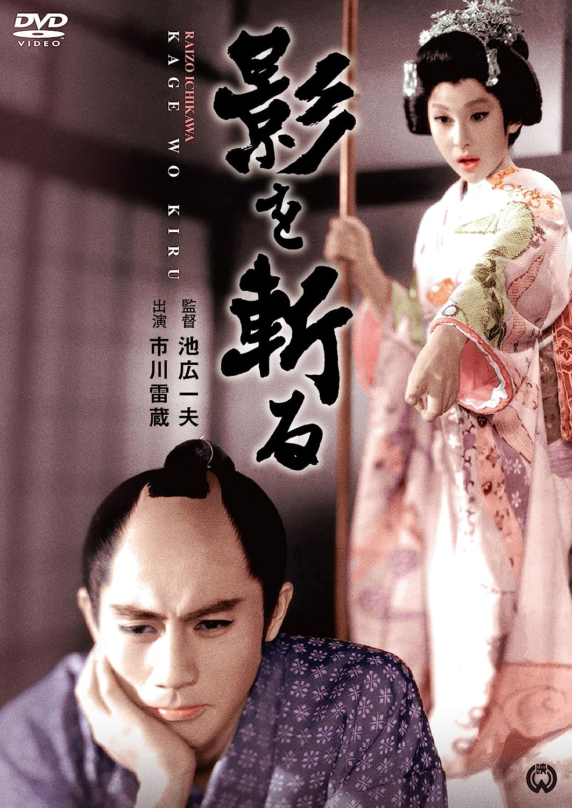

------

------

胭脂虎影 / 影を斬る (Kage o Kiru / Cut The Shadow) 是池广一夫于1963年导演，小国英雄脚本，齐藤一郎音乐，市川雷藏 / 瑳峨三智子主演的电影。英文字幕由coralsundy自费出资，jls001999听译制作完成。有少许错漏和语句不够流畅，可全程完整欣赏电影，适用于01:22:09的版本。

------

Kage o Kiru / Cut The Shadow (1963) is a 1963 movie directed by Kazuo Ikehiro, with notable stars Raizo Ichikawa and Michiko Saga.

------

**Translation/Subtitle**: jls001999 (jls001999@gmail.com) 
**Review/Proofreading**: coralsundy (coralsundy@gmail.com) 
*(Paid by coralsundy for the translation, personal use only)*

------

**中文字幕**: 尚无 
**English Subtitle**: [Kage.o.Kiru.aka.Cut.The.Shadow.1963.eng.01-22-09.BYjls001999.rev1.srt](../subtitles/Kage.o.Kiru.aka.Cut.The.Shadow.1963.eng.01-22-09.BYjls001999.rev1.srt)

------

**SUBHD**: <https://subhd.tv/a/> 
**IMDB**: <https://www.imdb.com/title/tt0165342/> 
**DOUBAN**: <https://movie.douban.com/subject/24719833/>

------

**More Movie Subtitles on My Website**: <a href=''>CLICK HERE</a>

