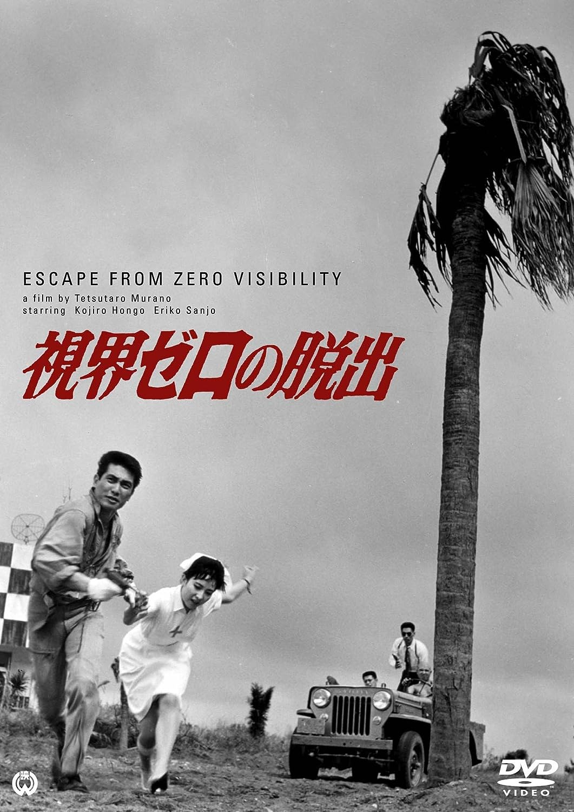

------

------

逃离零能见度 / 視界ゼロの脱出 (Shikai Zero no Dasshutsu / Zero Escape Visibility) 是村野铁太郎于1963年导演，安藤日出男脚本，山内正音乐，本乡功次郎 / 三条魔子 / 高松英郎主演的电影。英文字幕由coralsundy自费出资，jls001999听译制作完成。有少许错漏和语句不够流畅，可全程完整欣赏电影，适用于01:23:19的版本。由于电影年代久远，音轨质量一般，听译难免错漏，敬请谅解。

------

Shikai Zero no Dasshutsu / Zero Escape Visibility (1963) is a 1963 movie directed by Tetsutaro Murano, with notable stars Kojiro Hongo, Mako Sanjo, and Hideo Takamatsu.

------

**Translation/Subtitle**: jls001999 (jls001999@gmail.com) 
**Review/Proofreading**: coralsundy (coralsundy@gmail.com) 
*(Paid by coralsundy for the translation, personal use only)*

------

**中文字幕**: 尚无 
**English Subtitle**: [Shikai.Zero.no.Dasshutsu.aka.Zero.Escape.Visibility.1963.eng.01-20-34.BYjls001999.rev1.srt](../subtitles/Shikai.Zero.no.Dasshutsu.aka.Zero.Escape.Visibility.1963.eng.01-20-34.BYjls001999.rev1.srt)

------

**SUBHD**: <https://subhd.tv/a/> 
**IMDB**: <https://www.imdb.com/title/tt10029082/> 
**DOUBAN**: <https://movie.douban.com/subject/36522366/>

------

**More Movie Subtitles on My Website**: <a href=''>CLICK HERE</a>

